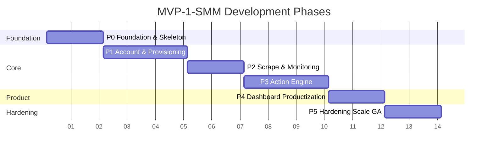

# Development Phase — MVP-1-SMM

> Dokumen ini memecah pembangunan sistem menjadi **6 phase (fase)** yang berurutan dan bisa diverifikasi. Setiap phase punya **goal, deliverable, exit criteria, dependency, dan risiko**. Setiap phase dipecah menjadi **tiket kerja** (lihat `TICKETS.md`).
>
> Prinsip phase: **jalan vertikal tipis dulu** (walking skeleton), baru melebar. Setiap phase harus menghasilkan **sesuatu yang bisa dilihat/dijalankan** — bukan sekadar "infrastruktur".

## Ringkasan 6 Phase

| Phase | Nama                                   | Durasi | Fokus                                                           | Deliverable Utama                                        |
| ----- | -------------------------------------- | ------ | --------------------------------------------------------------- | -------------------------------------------------------- |
| P0    | Foundation & Walking Skeleton          | 2 mgg  | Repo, CI, container, DB, auth, skeleton end-to-end              | `docker compose up` → dashboard kosong + 1 akun dummy    |
| P1    | Account Lifecycle & Provisioning       | 3 mgg  | Worker dinamis, login interaktif, session, proxy                | Add akun dari UI → container hidup → `authenticated`     |
| P2    | Scrape (IG + Threads) & Monitoring     | 2 mgg  | Apify scrape, ingest, metric, alert                             | Data post/komentar tampil + metric per akun              |
| P3    | Action Engine (Playwright)             | 3 mgg  | Worker action sequential, template, verifikasi                  | Comment/like tereksekusi & terverifikasi di feed         |
| P4    | Dashboard Productization & Operator UX | 2 mgg  | Worker Console, Job Queue, SSE, report, bulk import             | Operator kelola ratusan akun dari UI tanpa sentuh server |
| P5    | Hardening, Scale & GA                  | 2 mgg  | Scale ~50 container, health/quarantine, observability, security | 100 akun stabil 30 hari, nol ban, runbook lengkap        |

**Total ≈ 14 minggu.** P0–P3 = _critical path_ menuju nilai inti (scrape + action). P4–P5 bisa overlap sebagian dengan P3 bila ada kapasitas.

---

## P0 — Foundation & Walking Skeleton (2 minggu)

**Goal:** tim bisa `make up` dan mendapat sistem end-to-end minimal (FE → BE → DB) dalam 1 perintah, dengan CI hijau. **Target build = lokal Mac M2 16 GB** (docker-compose, ARM64, tanpa K8s — lihat `INFRA_ANALYST.md` §15.1/§15.2).

**Why:** semua phase berikut bergantung pada ini. Walking skeleton mengunci kontrak (OpenAPI, DB migration, container) sejak awal → menghindari integrasi kejutan di akhir.

**Scope**

- Monorepo: `pnpm` workspaces + `go.work` + turbo.
- `compose.yaml` (arm64): Postgres+TimescaleDB, Redis, MinIO, migrate, api, worker (dummy), web; `--scale worker=3`, `PROVISIONER_MODE=static`, `ACTION_DRY_RUN=true`.
- Skeleton BE Go (Echo + pgx + sqlc + golang-migrate + slog) dengan 1 endpoint `/healthz` + OpenAPI spec.
- Skeleton FE Next.js 15 + shadcn/ui (dark, indigo) + layout dashboard kosong + 1 halaman.
- Skeleton Worker Node (Playwright) — hanya heartbeat + log, belum ada action.
- Migration awal: `TeamConfig`, `User` (auth single-team), `AuditLog`.
- Auth sederhana (session cookie / JWT) + middleware RBAC 3 role.
- CI GitHub Actions lengkap (lint, test, build, scan) + pre-commit (`gitleaks`).
- Makefile: `make up`, `make test`, `make migrate`, `make seed`.

**Exit Criteria**

- [ ] `git clone && make up` → dashboard kosong tampil, `/healthz` OK, migrate jalan otomatis.
- [ ] 1 user bisa login; role terpasang.
- [ ] CI hijau di PR pertama (lint + test + build + Trivy).
- [ ] Semua service punya HEALTHCHECK + resource request/limit + non-root.
- [ ] OpenAPI spec ter-generate → FE type dari `packages/shared`.

**Dependency:** tidak ada (phase pertama).
**Risiko:** over-engineering infra (menegakkan K8s di lokal). Mitigasi: YAGNI — compose dulu; K8s/reconciler = jalur produksi (P1 prod), diuji opsional via envtest.

---

## P1 — Account Lifecycle & Provisioning (3 minggu)

**Goal:** operator menambah akun dari dashboard → BE provisioning container (K8s/pod) → worker login headful interaktif → session tersimpan → akun `authenticated`.

**Why:** tanpa akun aktif, tidak ada scrape/action. Ini fondasi operasional.

**Scope**

- ERD lengkap: `Account`, `Worker`, `ProxyGroup`, `ProvisionLog`, `Heartbeat`, enum (`AccountStatus`, `AuthStatus`, `WorkerStatus`, `DesiredState`).
- **Desired-state reconciler** (`Worker.desiredState` + `generation`) + K8s provisioner (`k8s.io/client-go`) + PVC `smm-session-<workerId>`.
- **Provisioning manual-by-default**: dashboard "Create Container" (pilih platform) → `Worker.desiredState=RUNNING`; fleet default kosong.
- **Assign akun (bin-packing)**: add akun → slot platform kosong → else auto-create (fallback, `PROVISION_AUTO_CREATE`); `MAX_ACCOUNTS_PER_CONTAINER`.
- Worker: bootstrap, `BLPOP` loop, subscribe `control-<workerId>`, heartbeat.
- **Login flow headful**: Xvfb + x11vnc + noVNC; `runLogin`/`waitForLoginOutcome`; persist `storageState` per platform.
- **Kredensial**: AES-256-GCM at rest; `control-<workerId>` `auth-login`/`auth-input`/`auth-clear`.
- **2FA/checkpoint**: status `NEEDS_INPUT`, context hidup, noVNC iframe + dialog `auth-input` OTP.
- Proxy binding (`ProxyGroup`, region-matched, context-level).
- Add Account UI (modal multi-step) + stepper SSE.
- `ProvisionLog` + orphan sweeper + rate limit K8s API.

**Exit Criteria**

- [ ] Tambah akun IG + Threads dari UI → 1 container meng-host keduanya (`@@unique([workerId, platform])` terbukti).
- [ ] Login interaktif sukses → `authenticated`; alur `needs_input` 2FA selesai lewat noVNC/OTP.
- [ ] Restart container → session terbaca, tidak login ulang.
- [ ] Pause → pod delete + PVC ditahan; Resume → ready tanpa login ulang.
- [ ] Remove akun terakhir → pod+PVC+service bersih.
- [ ] Orphan sweeper memulihkan 1 akun mati (test).

**Dependency:** P0.
**Risiko:** Meta mendeteksi otomasi saat login (headless/сookie kotor). Mitigasi: headful wajib, fingerprint fixed per container, proxy residential.

---

## P2 — Scrape (IG + Threads) & Monitoring (2 minggu)

**Goal:** data post/komentar dari IG + Threads masuk DB via Apify, dinormalisasi, dan ditampilkan sebagai metric per akun. Plus **monitoring akun resmi** (Official Accounts) via 3rd-party provider.

**Why:** nilai inti kedua (setelah akun) — observability konten & kompetitor + performa brand.

**Scope**

- `ScrapeJob` + scheduler FIFO + jitter 5-15 dtk + backoff rate limit.
- Apify adapter: actor per platform (post URL, profile, hashtag, mention); K8s Job ephemeral reuse kredensial akun.
- Ingest: raw → MinIO (S3) + normalisasi → Postgres (`Post`, `Comment`, `MetricSnapshot`).
- TimescaleDB hypertable untuk metric + retention (90 hari hot / 1 tahun cold).
- Metric: reach, views reels, mentions, live views (TikTok/IG live — deferred bila API tak ada).
- **Official Accounts (read-only, 3rd-party):** CRUD `OfficialAccount`; `Provider` adapter + `AnalyticsIngestRun`; ingest terjadwal 30 menit → `AnalyticsSnapshot` + `AnalyticsMention`; 7 halaman analytics per platform + Overview; freshness badge `stale`.
- Monitoring dashboard: metric per akun/post, sparkline, per-platform KPI strip.
- Alert engine: views drop > 50%/24 jam, mention spike > 3x, ingest gagal berulang.
- Session refresh job (`SESSION_REFRESH`, 7 hari sebelum expiry).

**Exit Criteria**

- [ ] Scrape IG + Threads end-to-end; Post + Comment masuk DB + tampil di dashboard.
- [ ] `MetricSnapshot` per 30 menit untuk top-100 post aktif.
- [ ] **Official Account (IG + Threads) ter-ingest dari provider: snapshot + tren + mention tampil di halaman per-platform.**
- [ ] **`AnalyticsIngestRun` tercatat; freshness badge tampil; provider down → graceful (snapshot terakhir + badge stale).**
- [ ] Alert mention spike & views drop firing di staging.
- [ ] Raw payload tersimpan di MinIO; normalisasi idempotent.
- [ ] Retention policy TimescaleDB aktif.

**Dependency:** P1 (butuh akun terautentikasi).
**Risiko:** Apify actor mahal / rate limit Meta. Mitigasi: budget cap, cache, batch.

---

## P3 — Action Engine (Playwright) (3 minggu)

**Goal:** worker mengeksekusi comment & like ke target secara sequential lintas akun, dengan template + verifikasi ground truth.

**Why:** nilai inti ketiga — auto-engagement. Ini bagian paling berisiko (ban).

**Scope**

- `ActionJob` + `ActionLog` + verdict per attempt (upsert UNIQUE `(actionJobId, attempt)`).
- Template pool: text + var `{topic}` `{product}` `{handle}`; random pick + dedupe 7 hari + ban-word detector.
- Worker action: adapter `PlatformAdapter` (IG/Threads) — `like`, `comment`, `verify`; registry (OCP).
- Sequential batch: `context` per akun, jitter 30-90 dtk, max 1 tab.
- **Verifikasi ground truth**: comment di feed, like state; gagal = `FAILED`.
- **Cooldown gate** per `(accountId, sha256(url))`.
- Rate limit per akun (IG 30/jam, Threads 15/jam) dipaksa scheduler BE.
- Callback `action-callback` + retry + sanitasi; `Idempotency-Key`.
- Action UI: queue 50 action, template composer, live status.
- Error classes: `TRANSIENT`/`AUTH`/`RATE_LIMIT`/`BANNED`.

**Exit Criteria**

- [ ] 100 like/comment tereksekusi via Playwright, success rate ≥ 85% (akun dummy).
- [ ] Comment terverifikasi muncul di feed (bukan klaim buta).
- [ ] Cooldown gate mencegah double-action ke target sama.
- [ ] Rate limit scheduler teruji (tidak melebihi kuota).
- [ ] Verdict `running`/`success`/`failed` tampil real-time di Job Queue.

**Dependency:** P1 (akun+session), P2 (target scraping, opsional untuk MVP action pakai URL manual).
**Risiko:** ban massal. Mitigasi: volume rendah, jitter, residential proxy, health quarantine, kill-switch.

---

## P4 — Dashboard Productization & Operator UX (2 minggu)

**Goal:** operator mengelola ratusan akun + job dari UI tanpa menyentuh server; strategist/analyst dapat report.

**Why:** skala operasional (100+ akun) hanya feasible dengan UI yang baik.

**Scope**

- **Worker Console**: grid `ContainerCard` (container + child account rows), ops Pause/Resume/Remove.
- **Job Queue**: virtualized table, group per akun, drawer attempt history + screenshot.
- **SSE realtime** (`GET /api/stream`): `action-updated`, `account-updated`, `worker-health`, `provision-updated`.
- **Report builder** + export CSV/JSON + schedule email mingguan.
- **Bulk import** CSV (maks 100 baris) + progress + antrian challenge.
- **Live ticker** + `LiveBrowserModal` (noVNC iframe).
- RBAC UI per role (Strategist/Operator/Analyst).
- Design system lengkap (Storybook semua custom komponen + a11y test).

**Exit Criteria**

- [ ] Operator kelola 100 akun (add/pause/remove/bulk) dari UI tanpa redeploy.
- [ ] Job Queue virtualized > 1000 baris lancar; SSE < 2 dtk latensi.
- [ ] Report CSV/JSON valid; schedule email terkirim.
- [ ] Semua komponen custom ada Storybook + axe lolos.
- [ ] Bundle budget tiap route terpenuhi.

**Dependency:** P1–P3.
**Risiko:** SSE reconnect/backpressure. Mitigasi: frame entitas penuh + refetch on reconnect.

---

## P5 — Hardening, Scale & GA (2 minggu)

**Goal:** sistem stabil di skala produksi (100 akun / ~50 container), aman, terobservasi, runbook lengkap → GA.

**Why:** MVP → produksi butuh bukti ketahanan, bukan hanya fitur.

**Scope**

- Scale test: ~50 container (100 akun), bin-packing teruji, quota namespace 500 pod.
- Health score 0-100 + auto-quarantine < 30 + anti-flapping (max 3 restart/10 menit).
- Observability: Prometheus metric lengkap + Grafana dashboard + Loki + alert → Slack.
- Security review: RBAC minimal, secret rotation, `gitleaks`, Trivy, `govulncheck`.
- Backup & restore: Postgres (WAL), MinIO, PVC session; DR drill.
- Runbook per alert + severity matrix + on-call.
- Load test FE (dashboard p95 < 1.5 dtk) + BE (throughput).
- Cost monitoring (proxy/apify budget cap).
- Docs final: PRD/ERD/SYSTEM_DESIGN/DESIGN_SYSTEM/DEVELOPMENT_RULE sync + ADR lengkap.

**Exit Criteria**

- [ ] 100+ akun stabil 30 hari (uptime ≥ 98%, action success ≥ 90%).
- [ ] Nol ban (atau terkendali) dalam window monitoring.
- [ ] Alert → Slack teruji end-to-end; MTTR worker failure < 5 menit.
- [ ] DR drill sukses (restore < 30 menit).
- [ ] Semua runbook + severity matrix tersedia.
- [ ] Security review sign-off.

**Dependency:** P1–P4.
**Risiko:** ban muncul saat scale. Mitigasi: ramp-up bertahap, quarantine cepat, kill-switch per platform.

---

## Critical Path & Milestone

| Milestone | Phase | Arti                               |
| --------- | ----- | ---------------------------------- |
| M1        | P0    | Walking skeleton jalan lokal       |
| M2        | P1    | Akun hidup end-to-end dari UI      |
| M3        | P2    | Data konten masuk (scrape)         |
| M4        | P3    | Action tereksekusi & terverifikasi |
| M5        | P4    | Operator skala 100 akun via UI     |
| M6        | P5    | GA — stabil, aman, terobservasi    |

## Definition of Done (per phase)

Phase dianggap selesai bila: exit criteria semua ✅, CI hijau, dokumentasi terkait di-update, demo ke stakeholder, dan tidak ada tiket P0/P1 tersisa di phase tersebut (lihat `TICKETS.md` untuk prioritas).
