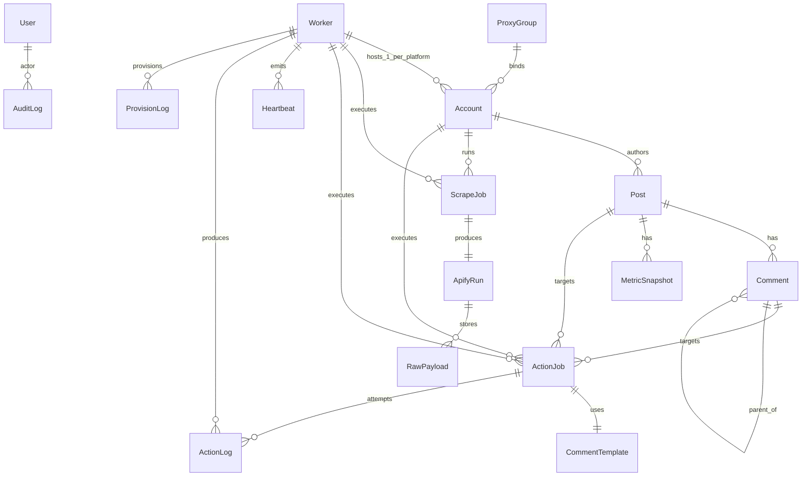

# ERD — Social Media Management



## Skema (Postgres)

> **Reference model.** Ini representasi entity + relasi (pseudo-schema), **bukan** source of truth. DDL riil ditulis di `apps/api/db/migrations/*.sql` via golang-migrate; query via sqlc (`db/queries/*.sql`). Nama tipe Go/enum di-generate sqlc dari DDL.
>
> Single-team. Tanpa `Workspace`. Semua entity root = `TeamConfig` (singleton). Saat jadi multi-tenant, ganti `TeamConfig` → `Workspace` + tambah `workspaceId` di setiap tabel.

```text
// reference-model (pseudo-schema, bukan file yang di-compile)
// DDL riil di db/migrations/*.sql; tipe Go di-generate sqlc.
// Notasi `model` di bawah cuma shorthand entity — bukan Prisma.

enum Role         { OWNER STRATEGIST OPERATOR ANALYST }
enum Platform     { INSTAGRAM THREADS FACEBOOK TIKTOK LINKEDIN X YOUTUBE }
enum WorkerStatus { PENDING READY IDLE BUSY DRAINING ERROR DEAD QUARANTINED }
enum JobStatus    { PENDING RUNNING SUCCESS FAILED RETRY CANCELLED }
enum JobType      { SCRAPE_LIKE SCRAPE_COMMENT SCRAPE_METRIC SESSION_REFRESH ACTION_LIKE ACTION_COMMENT }
enum TargetKind   { POST COMMENT }
enum AuthStatus   { AUTHENTICATING NEEDS_INPUT AUTHENTICATED FAILED }
enum DesiredState { RUNNING STOPPED }
enum WorkerSource { MANUAL AUTO } // MANUAL = dibuat user dari dashboard; AUTO = auto-create saat bin-packing
enum ProvisionOp  { CREATE DELETE }
enum AccountStatus { PENDING ACTIVE PAUSED QUARANTINED DEAD ARCHIVED }
```

Entity (kolom kunci, tipe snake_case di DDL):

```text

model TeamConfig {
  id        String   @id @default(cuid())
  name      String
  createdAt DateTime @default(now())
  // singleton; migrasi ke Workspace saat SaaS
}

model User {
  id           String   @id @default(cuid())
  email        String   @unique
  name         String
  passwordHash String
  role         Role
  auditLogs    AuditLog[]
  createdAt    DateTime @default(now())
}

model ProxyGroup {
  id            String   @id @default(cuid())
  name          String
  region        String   // ISO country code
  provider      String   // brightdata|smartproxy|oxylabs
  poolKey       String   // encrypted at rest
  maxConcurrency Int     @default(5)
  dailyBudgetMb Int      @default(1024)
  accounts      Account[]
  @@unique([name])
}

model Account {
  id              String   @id @default(cuid())
  platform        Platform
  username        String              // input login (nama/username platform)
  passwordEnc     Bytes               // AES-256-GCM; nonce 12-byte prepend; WRITE-ONLY — tidak pernah di-select/di-decrypt lewat API
  authStatus      AuthStatus @default(AUTHENTICATING) // state machine login (dipisah dari `status` lifecycle)
  handle          String?             // diverifikasi worker dari halaman profil setelah login sukses
  lastVerifiedAt  DateTime?
  credentials     Json?    // fallback cookie blob (encrypted) — jalur paste-cookie legacy
  cookieExpiryAt  DateTime?
  proxyGroupId    String?
  proxyGroup      ProxyGroup? @relation(fields: [proxyGroupId], references: [id])
  healthScore     Int      @default(100)
  status          AccountStatus @default(PENDING) // pending|active|paused|quarantined|dead|archived
  tags            String[] @default([])       // batch grouping
  workerId        String?
  worker          Worker?  @relation(fields: [workerId], references: [id]) // NULL = belum di-pack ke container
  lastUsedAt      DateTime?
  lastCheckedAt   DateTime?
  scrapeJobs      ScrapeJob[]
  actionJobs      ActionJob[]
  createdAt       DateTime @default(now())
  @@unique([workerId, platform])               // JANTUNG: max 1 akun per platform dalam 1 container
  @@unique([platform, username])               // akun sama tidak boleh ada di 2 container
  @@index([status])
  @@index([authStatus])
  @@index([workerId])
  @@index([healthScore])
  @@index([tags])
}

// 1 Worker = 1 container = 1 "device". Meng-host BANYAK akun,
// maksimal 1 akun per platform (dijaga @@unique([workerId, platform]) di Account).
// Contoh: container A = {IG: foo, Threads: bar}. Container B = {IG: baz, Threads: qux}.
// Sequential action batch per container; session persist per platform di 1 PVC.
model Worker {
  id             String       @id @default(cuid())
  name           String       @unique  // label operator: "farm-us-01"
  containerId    String?      @unique  // K8s pod ID (container = unit provisioning)
  controlChannel String?               // Redis: control-<workerId>
  actionQueue    String?               // Redis list: queue:action:<workerId> (job bawa accountId)
  sessionPvc     String?               // K8s PVC: smm-session-<workerId> (storageState per platform)
  novncService   String?               // ClusterIP service noVNC dalam pod (tidak pernah publik)
  desiredState   DesiredState @default(RUNNING) // sumber keinginan provisioning container
  source         WorkerSource @default(MANUAL)  // MANUAL = user-created (tak auto-delete saat 0 akun); AUTO = fallback auto-create (auto-delete saat 0 akun)
  region         String                // region default pod (proxy per-akun bisa override)
  status         WorkerStatus @default(IDLE)
  generation     Int          @default(1) // naik tiap reconcile apply; guard anti-spawn-ganda
  observedGen    Int?                  // generation terakhir yang di-ACK K8s/worker (pod label smm.generation)
  provisionErr   String?               // error terakhir dari provisioner (K8S_QUOTA|K8S_TIMEOUT|...)
  browserStatus  String       @default("cold") // cold|ready|busy|error
  currentJobId   String?              // ActionJob yang sedang berjalan
  lastHeartbeat  DateTime?
  lastActionAt   DateTime?
  lastError      String?
  queueDepth     Int          @default(0)
  restartCount   Int          @default(0)
  imageVersion   String       @default("v0.1")
  accounts       Account[]
  heartbeats     Heartbeat[]
  scrapeJobs     ScrapeJob[]
  actionJobs     ActionJob[]
  actionLogs     ActionLog[]
  provisionLogs  ProvisionLog[]
  createdAt      DateTime     @default(now())
  @@index([status])
  @@index([desiredState])
  @@index([lastHeartbeat])
  @@index([currentJobId])
}

model Heartbeat {
  id        String   @id @default(cuid())
  workerId  String
  worker    Worker   @relation(fields: [workerId], references: [id])
  ts        DateTime @default(now())
  cpu       Float
  mem       Float
  jobsDone  Int
  @@index([workerId, ts])
}

model Target {
  id          String     @id @default(cuid())
  kind        TargetKind
  platform    Platform
  externalId  String
  url         String
  meta        Json?
  scrapeJobs  ScrapeJob[]
  actionJobs  ActionJob[]
  post        Post?      @relation(fields: [postId], references: [id])
  postId      String?
  comment     Comment?   @relation(fields: [commentId], references: [id])
  commentId   String?
  @@index([platform, externalId])
  @@index([kind])
}

model ScrapeJob {
  id          String   @id @default(cuid())
  type        JobType
  targetId    String
  target      Target   @relation(fields: [targetId], references: [id])
  accountId   String?
  account     Account? @relation(fields: [accountId], references: [id])
  workerId    String?
  worker      Worker?  @relation(fields: [workerId], references: [id])
  status      JobStatus @default(PENDING)
  scheduledAt DateTime
  startedAt   DateTime?
  finishedAt  DateTime?
  attempts    Int       @default(0)
  error       String?
  apifyRun    ApifyRun?
  createdAt   DateTime  @default(now())
  @@index([status, scheduledAt])
  @@index([workerId, status])
  @@index([accountId, status, scheduledAt])
}

model ApifyRun {
  id          String   @id @default(cuid())
  scrapeJobId String   @unique
  scrapeJob   ScrapeJob @relation(fields: [scrapeJobId], references: [id])
  actorId     String
  runId       String
  status      String
  rawPayloads RawPayload[]
  startedAt   DateTime
  finishedAt  DateTime?
}

model RawPayload {
  id          String   @id @default(cuid())
  apifyRunId  String
  apifyRun    ApifyRun @relation(fields: [apifyRunId], references: [id])
  s3Key       String
  bytes       Int
  receivedAt  DateTime @default(now())
}

model Post {
  id           String   @id @default(cuid())
  platform     Platform
  externalId   String
  authorHandle String
  authorId     String
  text         String?
  mediaUrls    String[]
  metrics      Json
  scrapedAt    DateTime @default(now())
  authorAccountId String?
  authorAccount Account? @relation(fields: [authorAccountId], references: [id])
  comments     Comment[]
  snapshots    MetricSnapshot[]
  targets      Target[]
  @@unique([platform, externalId])
  @@index([authorHandle])
}

model Comment {
  id           String   @id @default(cuid())
  postId       String
  post         Post     @relation(fields: [postId], references: [id])
  platform     Platform
  externalId   String
  authorHandle String
  text         String
  metrics      Json
  scrapedAt    DateTime @default(now())
  parentId     String?
  parent       Comment? @relation("CommentParent", fields: [parentId], references: [id])
  children     Comment[] @relation("CommentParent")
  targets      Target[]
  @@unique([platform, externalId])
}

model MetricSnapshot {
  id        String   @id @default(cuid())
  postId    String
  post      Post     @relation(fields: [postId], references: [id])
  ts        DateTime @default(now())
  views     Int      @default(0)
  likes     Int      @default(0)
  comments  Int      @default(0)
  shares    Int      @default(0)
  reach     Int?
  reelsViews Int?
  @@index([postId, ts])
}

model CommentTemplate {
  id          String   @id @default(cuid())
  platform    Platform
  text        String
  vars        String[] // ["topic","product"]
  weight      Int      @default(1)   // random weighted pick
  bannedWords String[] @default([])
  actionJobs  ActionJob[]
  actionLogs  ActionLog[]
  @@index([platform])
}

model ActionJob {
  id          String   @id @default(cuid())
  type        JobType
  targetId    String
  target      Target   @relation(fields: [targetId], references: [id])
  templateId  String?
  template    CommentTemplate? @relation(fields: [templateId], references: [id])
  accountId   String
  account     Account  @relation(fields: [accountId], references: [id])
  workerId    String?
  worker      Worker?  @relation(fields: [workerId], references: [id])
  status      JobStatus @default(PENDING)
  scheduledAt DateTime
  startedAt   DateTime?
  finishedAt  DateTime?
  attempts    Int       @default(0)
  error       String?
  actionLogs  ActionLog[]
  createdAt   DateTime @default(now())
  @@index([status, scheduledAt])
  @@index([accountId, status, scheduledAt])
}

model Report {
  id        String   @id @default(cuid())
  name      String
  spec      Json     // {accounts:[], metrics:[], range:{}}
  schedule  String?  // cron expr
  lastRunAt DateTime?
  createdAt DateTime @default(now())
}

model AuditLog {
  id        String   @id @default(cuid())
  actorId   String
  user      User?    @relation(fields: [actorId], references: [id])
  action    String
  entity    String
  entityId  String
  diff      Json?
  ts        DateTime @default(now())
  @@index([ts])
  @@index([actorId, ts])
}

model ActionLog {
  id              String   @id @default(cuid())
  actionJobId     String
  actionJob       ActionJob @relation(fields: [actionJobId], references: [id])
  verified        Bool      @default(false) // ground-truth check: teks komentar muncul di feed / state like berubah
  workerId        String?
  worker          Worker?  @relation(fields: [workerId], references: [id])
  templateId      String?
  template        CommentTemplate? @relation(fields: [templateId], references: [id])
  attempt         Int
  renderedText    String   // text final setelah var injection
  responseExcerpt String?  // 500 char pertama response IG/Threads
  errorClass      String?  // TRANSIENT|AUTH|RATE_LIMIT|BANNED|UNKNOWN
  screenshotUrl   String?  // S3 key
  durationMs      Int
  ts              DateTime @default(now())
  @@unique([actionJobId, attempt]) // jantung upsert: callback running+terminal = baris sama
  @@index([workerId, ts])
  @@index([errorClass])
}

model ProvisionLog {
  id         String      @id @default(cuid())
  workerId   String
  worker     Worker      @relation(fields: [workerId], references: [id])
  op         ProvisionOp // CREATE|DELETE
  generation Int
  k8sRef     String?     // pod name hasil/ci
  status     String      // PENDING|APPLIED|FAILED
  error      String?
  ts         DateTime    @default(now())
  @@index([workerId, ts])
  @@index([status])
}

model Setting {
  key       String   @id
  value     Json
  updatedAt DateTime @updatedAt
}
```

## Index Penting

- `Account(platform, handle)` unique — lookup akun.
- `Account(status, healthScore)` — eligible worker selection.
- `Post(platform, externalId)` unique — lookup post dari scrape.
- `MetricSnapshot(postId, ts)` — time-series query.
- `ActionJob(accountId, status, scheduledAt)` — antrian per akun.
- `ScrapeJob(accountId, status, scheduledAt)` — fair scheduler per akun.
- `Worker(lastHeartbeat)` — health sweep.

## Catatan

- `Account.passwordEnc` + `Account.credentials` + `ProxyGroup.poolKey` di-encrypt at-rest (AES-256-GCM, key dari K8s Secret; hilang/ubah key = kredensial tak terbaca,_by design_).
- **`passwordEnc` write-only**: tidak pernah ikut SELECT, tidak pernah keluar di API. Plaintext hanya hidup di memori BE antara request create dan `PUBLISH control-<workerId>`, lalu hanya di memori worker selama login.
- `Account.authStatus` state machine: `AUTHENTICATING → AUTHENTICATED | NEEDS_INPUT | FAILED`. `NEEDS_INPUT` bisa berulang (checkpoint kedua Meta). `NEEDS_INPUT` + worker restart = konteks hidup hilang → akun macet sampai login diulang (diterima sebagai informasi, bukan bug — lihat Worker Rule).
- Verdict disimpan **per attempt sebagai baris `ActionLog`** (upsert UNIQUE `(actionJobId, attempt)`, `screenshotUrl` pakai COALESCE agar callback `running` tidak menghapus shot lama). `ActionJob.status` adalah proyeksi attempt terakhir.
- **`PENDING` ≠ `FAILED`**: tidak ada reaper yang menandai job `PENDING` lama jadi `FAILED`. `PENDING` = worker belum pernah claim; `FAILED` = worker menjalankan & melaporkan gagal. Membedakannya: `receivers` di response create + `updated_at`.
- `RawPayload` S3 key disimpan, bukan payload (hemat DB).
- `AuditLog` wajib untuk action seperti kill worker, edit template, hapus akun, manual action.
- Tabel `TeamConfig` saat ini singleton (satu baris). Saat jadi multi-tenant, replace dengan `Workspace` + tambah `workspaceId` ke semua tabel yang sebelumnya root entity.
- **1 Worker = 1 container = 1 "device", meng-host BANYAK akun — maks 1 per platform.** Dijaga `@@unique([workerId, platform])`. MVP platform IG+Threads → maks 2 akun/container. `Account.workerId` NULL = belum di-pack (bin-packing belum assign slot).
  - Alasan: satu device nyata memang punya 1 sesi per platform. Fingerprint (UA/viewport/locale) tetap per-container; tiap akun punya `context` + `storageState` sendiri (isolasi cookie).
  - Container dibuat **manual** (`source=MANUAL`, user pilih platform) atau via **fallback auto-create** saat bin-packing tak temukan slot (`source=AUTO`). **Auto-delete container 0-akun hanya berlaku untuk `source=AUTO`**; container `MANUAL` bertahan sampai user menghapusnya (bisa di-pre-provision sebelum ada akun).
  - Blast radius: 1 pod mati = maks N akun idle (N = jumlah platform, ≤2 di MVP), bukan 1 akun.
- **Desired-state provisioning ada di `Worker`** (container = unit provisioning): `Worker.desiredState` (`RUNNING|STOPPED`) = sumber keinginan. Reconciler bandingkan desired vs actual (`Worker.containerId` + pod label `smm.generation`). **Fleet default = kosong**: tidak ada `Worker` row sampai user membuat container dari dashboard (atau fallback auto-create saat add-akun).
  - `STOPPED` (pause container) → drain → delete pod → **PVC session ditahan** (resume tanpa login ulang).
  - Remove container → `Account.status=archived` untuk semua akunnya + delete pod + delete PVC + hapus `Worker` row.
- **`Worker.generation` + `observedGen` = guard anti-spawn-ganda.** Tiap reconcile `apply` menaikkan `generation`; pod dilabeli `smm.generation=<n>`. Pod dengan generation < `observedGen` atau pod kedua untuk `(workerId, generation)` sama = **orphan** → dibunuh. Idempotent: retry reconcile generation sama tidak spawn pod kedua. K8s jadi lock (pod = resource), pengganti `SETNX`.
- `ProvisionLog` = audit tiap op CREATE/DELETE (workerId, generation, hasil, error). Trace "kenapa pod ini ada" + observability reconcile loop.
- `Worker.provisionErr` = error terakhir provisioner (`K8S_QUOTA`, `K8S_TIMEOUT`, `PVC_PENDING`) untuk ContainerCard.
- `queueDepth` = action job pending **untuk seluruh container** (semua akunnya), indikator backpressure.
- `browserStatus` merefleksikan state Chromium container: cold (startup), ready (semua sesi platform siap), busy (action jalan), error (retry needed).
- `ActionLog` wajib per attempt: input (rendered text), output (response excerpt), error class, screenshot URL. Wajib untuk debug & audit compliance.
- `Setting` menyimpan runtime config (rate limit, jitter range, daily caps) — editable tanpa deploy.
- `Account.cookieExpiryAt` wajib: scheduler trigger re-login 7 hari sebelum expiry.
- `Worker.status` lifecycle: `PENDING` (pod creating) → `READY` (browser up) → `IDLE`/`BUSY` (job) → `DRAINING` (shutdown) → `DEAD` (pod mati / paused); `ERROR` (boot/timeout gagal) & `QUARANTINED` (container diparkir, tak boleh respawn).
- `Account.status` values: `pending|active|paused|quarantined|dead|archived`. `pending` = terdaftar tapi belum lolos login; `paused` = di-skip scheduler (container tetap hidup); `archived` = soft delete + purge setelah auto-cleanup.
- `JobType.SESSION_REFRESH` = trigger re-login Playwright sebelum cookie expired (F10).
