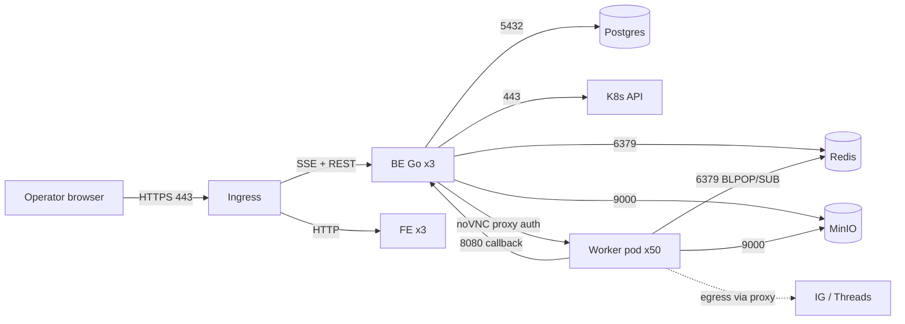

# Infra Analyst — MVP-1-SMM

> **Role:** Infrastructure Analyst. Dokumen ini adalah **analisis infrastruktur** untuk sistem SMM (scrape + monitor + auto-act IG/Threads, MVP). Pelengkap `SYSTEM_DESIGN.md` (yang mendefinisikan _apa_ yang dibangun) — dokumen ini menjawab _seberapa besar, seberapa mahal, seberapa tahan, dan di mana bottlenecknya_.
>
> **Metode:** workload characterization → sizing model (dengan hitungan eksplisit & asumsi) → kapasitas → HA/DR → keamanan → observability → biaya → risiko. Semua angka diberi **asumsi** agar bisa direview ulang saat data nyata tersedia.
>
> **Prinsip:** all self-hosted (container, tanpa managed service di MVP), single-region, 1 region = 1 cluster. Angka $ = USD.

---

## 1. Ringkasan Eksekutif (TL;DR)

| Dimensi             | Kesimpulan (MVP)                                                                                                                                                |
| ------------------- | --------------------------------------------------------------------------------------------------------------------------------------------------------------- |
| Workload dominan    | **Worker pod berbasis browser** (Chromium headful). ≠ CPU-bound, tapi **memory-bound** dan **long-lived/idle** (hot path hanya ~1 action/60 dtk per container). |
| Skala MVP           | ~50 container worker (100 akun) + 3 BE + 3 FE + 1 Postgres + 1 Redis + 4 MinIO.                                                                                 |
| Bottleneck #1       | **Batas memory node worker** (Chromium 2 ctx). CPU sangat under-utilized (idle-heavy).                                                                          |
| Bottleneck #2       | **K8s API rate** saat burst create (`10/min`) — sudah dimitigasi bin-packing + queue.                                                                           |
| Bottleneck #3       | **Biaya proxy residential** (dominan, ~67% total biaya) — bukan compute.                                                                                        |
| Compute cluster MVP | **3 node worker** (32 GB) + 3 node app + 1–3 node data ≈ 7 node.                                                                                                |
| Estimasi biaya      | **~$3.3k/bulan**, 67% di proxy. Compute hanya ~15%.                                                                                                             |
| Target ketahanan    | Uptime ≥ 98%, RPO 5 menit, RTO 30 menit, anti-flapping 3 restart/10 menit.                                                                                      |
| Keputusan menunggu  | PgBouncer (P5+), Redis HA (100–500 pod), read replica (500+), node provider.                                                                                    |

**Insight utama:** sistem ini **tidak butuh CPU besar** — ia butuh _banyak pod kecil yang tahan idle dengan memory cukup untuk Chromium_, plus _bandwidth proxy_. Optimasi biaya terbesar ada di **proxy**, bukan compute.

---

## 2. Workload Characterization

Sebelum sizing, karakterisasi beban per komponen.

### 2.1 Profil Beban per Komponen

| Komponen                         | Pola                                   | CPU                        | Memori                                         | I/O                   | Network                          | Durasi proses          |
| -------------------------------- | -------------------------------------- | -------------------------- | ---------------------------------------------- | --------------------- | -------------------------------- | ---------------------- |
| **Worker** (Playwright)          | Long-running, bursty, idle-heavy       | Rendah (spike saat action) | **Tinggi & konstan** (Chromium + Xvfb + noVNC) | Sedang (session file) | Tinggi (proxy egress)            | Persistent (umur akun) |
| **BE (Go)**                      | Request-driven + cron                  | Rendah–sedang              | Rendah                                         | DB query              | Rendah                           | Persistent             |
| **FE (Next.js)**                 | Request-driven                         | Rendah                     | Rendah                                         | —                     | Rendah (SSE stream)              | Persistent             |
| **Scrape Job** (Apify/ephemeral) | Burst, pendek                          | Rendah (eksternal Apify)   | Rendah                                         | Object store write    | Tinggi saat ingest               | Ephemeral (menit)      |
| **Postgres+Timescale**           | Write metric periodik + read dashboard | Sedang                     | Sedang                                         | **Disk-intensive**    | Rendah                           | Persistent             |
| **Redis**                        | Queue + Pub/Sub + cooldown + cache     | Rendah                     | Sedang (maxmemory 512 MB)                      | AOF write             | Rendah                           | Persistent             |
| **MinIO**                        | Object write/read                      | Rendah                     | Sedang                                         | **Disk-intensive**    | Tinggi (raw payload, screenshot) | Persistent             |

### 2.2 Karakterisasi Detail Worker (komponen paling menentukan)

Per container (device) meng-host N akun (maks 1/platform; MVP = 2):

```
Per container:
  1× Chromium headful (Xvfb :99 + x11vnc + noVNC websockify)   ~400–600 MiB baseline
  1× BrowserContext (per akun, tapi hanya 1 aktif pada satu waktu karena concurrency=1)
      + tab aktif                                                ~200–400 MiB per context hidup
  Node runtime + apify-client + log                              ~100 MiB
  ------------------------------------------------------------------------------
  Baseline idle (context kebanyakan tertutup):                   ~600–800 MiB
  Peak (1 context + 1 tab aktif + render feed):                  ~1.2–1.8 GiB
  Spike (challenge/login, video autoplay, GC):                   s.d. ~3–4 GiB
```

**Kesimpulan sizing (LOCKED):** `request = 750m CPU / 1 GiB`, `limit = 2000m CPU / 4 GiB`. Idle sebenarnya < 1 GiB; CPU di-overcommit (beban idle-heavy); **memory overcommit dilarang** (OOMKill = akun mati). Reservasi CPU 50 pod ≈ 37 vCPU.

> **Rekomendasi Infra Analyst (right-sizing):** request `750m / 1Gi`, limit `2000m / 4Gi`. Alasan: CPU request besar menyia-nyiakan kapasitas node (idle-heavy); memory limit tetap 4 GiB untuk spike Chromium. **Memory overcommit = dilarang** (OOMKill = akun mati). Ini turunkan reservasi CPU dari 50 → ~37 vCPU untuk 50 pod.

### 2.3 Throughput & Concurrency

- 1 container = **concurrency 1** → ~1 action / 60 dtk → **~60 action/jam/container**.
- 50 container → **~3.000 action/jam** total; tetap di bawah rate limit per-akun (IG 30/jam, Threads 15/jam → 45/jam/container) → headroom besar.
- **Batch model** (`ACTION_BATCH_PARALLELISM`, default 4): pada satu momen hanya ±N container aktif spike Chromium sekaligus; sisanya idle. Ini **memperkuat** right-sizing §2.2 — reservasi request 1 GiB cukup; yang penting **limit** 4 GiB cukup untuk spike container aktif (N × 4 GiB harus tertampung node, bukan 50 × 4 GiB).
- Scrape: bursty, dijalankan sebagai Job ephemeral; tidak membebani pod worker.

---

## 3. Sizing Model

### 3.1 Node Pools

| Pool         | Taint                        | Isi                       | Node spec (MVP)                 | Jumlah            |
| ------------ | ---------------------------- | ------------------------- | ------------------------------- | ----------------- |
| `smm-app`    | `smm-app=true:NoSchedule`    | BE (3) + FE (3)           | 4 vCPU / 16 GiB                 | 1–2               |
| `smm-worker` | `smm-worker=true:NoSchedule` | Worker pod (dinamis)      | 16 vCPU / 32 GiB (memory-dense) | **3** (MVP)       |
| `smm-data`   | `smm-data=true:NoSchedule`   | Postgres, Redis, MinIO    | 8 vCPU / 32 GiB + NVMe          | 1–3               |
| `system`     | control                      | API server, etcd, ingress | —                               | dikelola provider |

### 3.2 Hitungan Node Worker (bottleneck memory)

**Asumsi (MVP):** 50 container, request memory **1 GiB** (Q2, accepted), node 32 GiB dengan allocatable ~28 GiB (kube-reserved/system).

```
Kapasitas per node       = 28 GiB / 2 GiB      = 14 pod (memory-bound)
Dibutuhkan untuk 50 pod  = ceil(50 / 14)       = 4 node
Dengan HA/spare (N+1)    = 4 + 1               = 5 node  ... ATAU
Right-sized (1 GiB req)  = 28 / 1              = 28 pod → ceil(50/28)=2 node + spare = 3 node
```

**Keputusan:** pakai **3 node 32 GiB** dengan `request=1Gi` (right-sized) → 3×28 = 84 slot pod memory, cukup untuk 50 pod + headroom burst (spike diskalakan ke limit, bukan request). CPU: 3×16 = 48 vCPU ≫ 50×0.75 = 37 vCPU → aman.

> Jika tetap pakai `request=2Gi`: butuh **5 node**. Selisih 2 node ≈ hemat ~$120–160/bulan.

### 3.3 Hitungan Node Data

| Service              | Request           | Limit             | Storage                      | Catatan                       |
| -------------------- | ----------------- | ----------------- | ---------------------------- | ----------------------------- |
| Postgres + Timescale | 2 vCPU / 4 GiB    | 4 vCPU / 8 GiB    | PVC 100 GB NVMe (expandable) | WAL archive → MinIO           |
| Redis                | 500m / 512 MiB    | 1000m / 1 GiB     | PVC 5 GB                     | `maxmemory 512mb allkeys-lru` |
| MinIO (4 node EC)    | 2 vCPU / 2 GiB ×4 | 4 vCPU / 4 GiB ×4 | PVC 500 GB total             | erasure-coded 4+2             |

MVP: **1 node `smm-data`** (32 GiB/8 vCPU) cukup bila MinIO di-config 1-node (single-drive dev) — **tapi erasure-coding 4 node butuh 4 node**. Kompromi MVP: MinIO single node single-drive (reliability via versioning + backup), naik ke 4 node di v1.

### 3.4 Ringkasan Kapasitas MVP

| Pool      | Node  | vCPU total | Mem total   | Pod slot (memory)    |
| --------- | ----- | ---------- | ----------- | -------------------- |
| app       | 1     | 4          | 16 GiB      | BE 3 + FE 3 (ringan) |
| worker    | 3     | 48         | 96 GiB      | ~84                  |
| data      | 1     | 8          | 32 GiB      | Postgres+Redis+MinIO |
| **Total** | **5** | **60**     | **144 GiB** | —                    |

> Provider contoh: Hetzner CPX/CCX atau DO. 5 node ≈ $250–350/bulan (bandwidth termasuk) → konsisten dengan rollup compute ~$400 (dengan MinIO 4 node di v1).

---

## 4. Storage Capacity Planning

| Kategori                                   | Volume                       | Estimasi Growth                                                    | Retention                               | Backup                             |
| ------------------------------------------ | ---------------------------- | ------------------------------------------------------------------ | --------------------------------------- | ---------------------------------- |
| **DB state** (Account, Worker, Job, Audit) | PVC 100 GB                   | ~1–2 GB/bulan                                                      | tak terbatas (hot)                      | basebackup harian + WAL            |
| **MetricSnapshot** (Timescale)             | di dalam Postgres            | ~100k row/hari → **~3M/bulan**; compress > 7 hari → ~10–20% ukuran | 90 hari hot / 1 tahun cold              | ikut Postgres                      |
| **Raw payload Apify** (MinIO)              | bucket `raw-payload`         | per scrape ~50–500 KB → ratusan MB/hari                            | 90 hari → lalu lifecycle delete/Glacier | versioning                         |
| **Screenshots** (MinIO/volume)             | bucket `screenshots`         | ~30–80 KB/action → 3k action/hr → ~150 MB/hari                     | 30 hari → delete                        | versioning                         |
| **PVC session** (`smm-session-<workerId>`) | **512 MiB** × 50 = **25 GiB** (Q3) | flat (kecil, ~KB/session) | selama container hidup | cookie backup terenkripsi terpisah |
| **WAL/RDB archive**                        | bucket `pg-wal`, `redis-rdb` | WAL ~1–5 GB/hari                                                   | 7–30 hari                               | —                                  |
| **MinIO total**                            | PVC 500 GB                   | —                                                                  | lifecycle per bucket                    | erasure-code (v1)                  |

**Proyeksi 12 bulan (DB):**

```
MetricSnapshot: 3M/bulan × compress 0.15 ≈ 450k row-equivalent/bulan
  → 12 bulan ≈ 5.4M row-equivalent ≈ 15–25 GB (compressed)  ✔ dalam 100 GB
Raw payload:    ~200 MB/hari (90 hari retention)            ≈ 18 GB steady-state
Screenshots:    ~150 MB/hari (30 hari retention)            ≈ 4.5 GB steady-state
Session PVC:    100 GiB (statis, 50×2GiB)                   ✔
```

**Kesimpulan:** storage tidak jadi bottleneck 12 bulan pertama. **PVC session kini 512 MiB** (Q3, accepted) → total 25 GiB; cukup untuk 7 akun × storageState + margin (file hanya KB).

---

## 5. Network & Traffic

### 5.1 Peta Trafik



### 5.2 Egress (biaya & bottleneck proxy)

- Egress **worker → platform** HARUS lewat **residential proxy** (Bright Data primary, Smartproxy failover) — bukan langsung (ban risk + IP datacenter).
- **Per-akun ~200 MB/hari** (feed, image, video partial). 100 akun → **~20 GB/hari ≈ 600 GB/bulan** (plan) vs asumsi rollup 150 GB/bulan — **selisih besar**; lihat §8 optimasi.
- Konfigurasi: proxy di **level context** (1 akun = 1 proxy session/residential IP) untuk isolasi fingerprint.

### 5.3 NetworkPolicy (default deny)

| Source  | Destination                        | Port               | Alasan                                  |
| ------- | ---------------------------------- | ------------------ | --------------------------------------- |
| ingress | FE, BE                             | 3000/8080          | publik                                  |
| BE      | Postgres / Redis / MinIO / K8s API | 5432/6379/9000/443 | dependency                              |
| Worker  | BE                                 | 8080               | callback                                |
| Worker  | Redis                              | 6379               | BLPOP + Pub/Sub                         |
| Worker  | MinIO                              | 9000               | screenshot                              |
| Worker  | **egress proxy** (external)        | 443/8443           | scrape/action                           |
| BE      | Worker (noVNC)                     | 6080               | **hanya via BE (auth), tidak langsung** |
| —       | Worker                             | selain di atas     | **DENY**                                |

> noVNC (6080) **tidak** diekspos publik & **tidak** punya Ingress; akses hanya via BE yang meng-autentikasi operator lalu stream.

---

## 6. High Availability & Failure Domains

### 6.1 Blast Radius Matrix

| Komponen gagal        | Dampak                                           | Mitigasi                                                             | RTO                      |
| --------------------- | ------------------------------------------------ | -------------------------------------------------------------------- | ------------------------ |
| 1 worker pod          | **N akun idle** (N = platform/container, ≤2 MVP) | reconciler respawn (gen++), session di PVC → no re-login             | < 2 menit                |
| 1 node worker         | ~14–28 akun idle                                 | pod reschedule ke node lain; PDB `minAvailable: 50%`                 | < 5 menit                |
| BE (1 dari 3 replica) | 0 dampak                                         | Deployment 3 replica, rolling                                        | 0                        |
| Postgres (single)     | **TOTAL OUTAGE** (write)                         | backup + WAL; MVP single replica = SPOF yang diterima                | ≤ 30 menit (restore)     |
| Redis (single)        | **Queue/kontrol berhenti**                       | RDB+AOF; job durable di list (hilang → job hilang, perlu re-enqueue) | ≤ 10 menit               |
| MinIO                 | scrape/action screenshot gagal                   | versioning; retry                                                    | ≤ 10 menit               |
| K8s API               | provisioning berhenti (action tetap jalan)       | retry + queue                                                        | tergantung control plane |

### 6.2 SPOF yang Diterima (MVP) & Jalur Keluar

| SPOF                            | Kapan naik kelas        | Solusi                                               |
| ------------------------------- | ----------------------- | ---------------------------------------------------- |
| Postgres 1 replica              | > 500 pod / butuh 99.9% | streaming replica + failover (Patroni)               |
| Redis 1 replica                 | 100–500 pod             | Redis Sentinel / Cluster + sharding queue per region |
| MinIO 1 node                    | v1                      | 4-node erasure-coded                                 |
| BE single namespace worker pool | > 500 pod               | multi-namespace / multi-cluster per region           |

### 6.3 Backup & DR (ringkas — detail di SYSTEM_DESIGN §Backup & DR)

- RPO **5 menit** (WAL archive), RTO **30 menit** (single region).
- Backup harian: `pg_basebackup` → MinIO `pg-wal` (7 hari); Redis RDB per jam (7 hari); MinIO versioning on.
- **Verify harian:** `pg_restore` ke Postgres ephemeral di staging → alert jika gagal.
- **DR drill kuartalan:** restore Postgres + Redis di namespace terpisah → verify app boot.
- Cookie + KMS key: backup terenkripsi terpisah (`runbooks/dr-cookie-restore.md`).

---

## 7. Keamanan Infrastruktur

| Lapisan         | Kontrol                                                                                                           |
| --------------- | ----------------------------------------------------------------------------------------------------------------- |
| Cluster         | Pod Security Admission `restricted`; NetworkPolicy default-deny; taint per pool                                   |
| Runtime         | non-root UID 10001, read-only rootfs, drop ALL caps, seccomp `RuntimeDefault`                                     |
| Secrets         | **tidak ada** di image/env; K8s Secret + (**rekomendasi**) Sealed Secrets/SOPS terenkripsi di git; rotasi KMS key |
| Registry        | image pin **by digest**; Trivy scan per push (CVE high/critical block); Kyverno/OPA (v1) enforce signed image     |
| RBAC            | `smm-provisioner` SA: hanya `pods create,delete,get,list` namespace `smm`; **nol** akses secret/node/RBAC         |
| Internal API    | `/internal/*` mTLS (Linkerd) atau token + IP allowlist (worker ns saja)                                           |
| noVNC           | internal-only, di belakang BE auth; tidak diekspos                                                                |
| Supply chain    | `gitleaks` pre-commit, `govulncheck`/`pnpm audit` per PR, Dependabot                                              |
| Ketahanan creds | kredensial akun AES-256-GCM at-rest; write-only; dilarang di log (CI grep gate)                                   |

**Temuan Infra Analyst:**

1. Secret K8s mentah = risiko. **Rekomendasi:** Sealed Secrets / SOPS + rotasi terjadwal.
2. Belum ada **admission policy** menolak image tanpa digest/signature → tamper risk. Rekomendasi Kyverno di v1.
3. Egress worker ke proxy: pastikan **FQDN allowlist** (bukan allow-all) untuk batasi data exfiltration bila pod terkompromi.

---

## 8. Cost Model & Optimasi

### 8.1 Rollup Biaya (mengacu SYSTEM_DESIGN §Monthly Cost Rollup)

| Item                                   | Estimasi/bulan | %       |
| -------------------------------------- | -------------- | ------- |
| **Proxy residential (150 GB)**         | **$2,250**     | **67%** |
| Compute worker (~50 pod)               | $400           | 12%     |
| Node data (Postgres+Redis+MinIO, NVMe) | $200           | 6%      |
| Apify actor compute                    | $200           | 6%      |
| Bandwidth egress (~2 TB)               | $160           | 5%      |
| Compute BE/FE (3+3 pod)                | $80            | 2%      |
| Observability                          | $0–50          | ~1%     |
| **Total**                              | **~$3,340**    | 100%    |

### 8.2 Sensitivitas Biaya

```
Proxy = 67% total → 1 perubahan proxy = ~2/3 dampak total.
  · -30% bita proxy (blokir video/image besar)  ≈ hemat $675/bulan
  · Naik MAX_ACCOUNTS_PER_CONTAINER 2→7 (idle cost turun) ≈ compute -40% (≤ $160)
  · Right-size memory request (2→1 GiB): -2 node worker ≈ $120–160
Compute total = ~$680 (20%). Optimasi compute lebih kecil dampaknya dari proxy.
```

### 8.3 Rekomendasi Optimasi (berurut dampak)

| #   | Aksi                                                                                           | Dampak                | Kapan      |
| --- | ---------------------------------------------------------------------------------------------- | --------------------- | ---------- |
| 1   | **Blokir aset berat** (image/video) via route interception Playwright — scrape hanya HTML/JSON | ~-30% bita proxy      | **P2/P3**  |
| 2   | Naikkan `MAX_ACCOUNTS_PER_CONTAINER` saat platform bertambah                                   | compute idle turun    | P3+        |
| 3   | Right-size memory request worker (2→1 GiB)                                                     | -2 node               | **segera** |
| 4 | ~~Turunkan PVC session (2 GiB → 512 MiB)~~ **DONE (Q3)** | hemat ~75 GiB storage | P1 |
| 5   | Budget cap per akun + alert 90%                                                                | cegah runaway cost    | P5-08      |
| 6   | Compress Timescale > 7 hari + chunk mingguan                                                   | DB I/O turun          | P2         |

---

## 9. Rencana Kapasitas (Capacity Roadmap)

| Fase         | Pod worker | Akun    | Node worker | Bottleneck aktif   | Aksi infra                                                         |
| ------------ | ---------- | ------- | ----------- | ------------------ | ------------------------------------------------------------------ |
| **Staging**  | 3–5        | 6–10    | 1           | —                  | 1 node worker                                                      |
| **MVP (P5)** | ~50        | 100     | 3           | Memory node        | right-size + 3 node                                                |
| **v1**       | 100–250    | 200–500 | 6–10        | **Redis I/O**      | Redis Sentinel/Cluster + queue sharding per region                 |
| **v2**       | 500+       | 1000+   | 20+         | **Postgres write** | read replica + Patroni + Timescale chunk/compress; multi-namespace |

> Menambah platform (s.d. 7, lihat `PLATFORM_MATRIX.md`) menaikkan akun/container → blast radius naik, tetapi efisiensi node naik (lebih banyak akun per pod idle).

**Ambang pentrigger (thresholds):**

- `worker_heartbeat_age_seconds` p95 > 60 → node saturated.
- `k8s_pod_pending_total` > 0 selama 5 menit → kapasitas/quota kurang.
- Redis `used_memory` > 70% maxmemory → naik kelas Redis.
- Postgres p95 write latency > 50ms → pertimbangkan read replica / PgBouncer.
- Proxy budget harian > 90% → **alert** (bukan tunggu EOM).

---

## 10. Lingkungan (Environments)

| Env         | Orkestrasi               | Skala                   | Tujuan                                        | Data       |
| ----------- | ------------------------ | ----------------------- | --------------------------------------------- | ---------- |
| **dev**     | `docker compose`         | 1 worker, 1 akun        | DX cepat, parity tinggi                       | dummy      |
| **staging** | K8s (1 ns `smm-staging`) | 3–5 worker, 1 node      | verifikasi integrasi, DR drill, migration dry | sanitized  |
| **prod**    | K8s (ns `smm`)           | dinamis (desired-state) | operasi nyata                                 | production |

**Aturan parity:** image sama (tag sama), config via env/Secret, **tidak ada** perbedaan kode antar-env. Deploy: `main` → staging otomatis; prod **manual promote** (`workflow_dispatch`).

---

## 11. Observability (spesifik infra)

| Sinyal     | Sumber                                               | Dipakai untuk                                                                                   |
| ---------- | ---------------------------------------------------- | ----------------------------------------------------------------------------------------------- |
| Metric     | Prometheus (kube-state, node-exporter, cAdvisor)     | kapasitas node/pod, OOMKill, restart                                                            |
| App metric | BE/Worker `/metrics`                                 | `worker_heartbeat_age_seconds`, `jobs_processed_total{status}`, `http_request_duration_seconds` |
| Log        | `slog`/pino → Loki                                   | troubleshooting, audit                                                                          |
| Trace      | OpenTelemetry → Jaeger/Tempo                         | latency action end-to-end                                                                       |
| Cost       | `proxy_bytes_used_total`, `apify_run_cost_usd_total` | budget guardrail                                                                                |
| Alert      | Alertmanager → Slack `#smm-oncall`                   | runbook per alert                                                                               |

**Alert infra penting:** `NodeMemoryPressure`, `PodOOMKilled` (per container), `PodPending` (kuota/kapasitas), `K8sApiRateLimited`, `PersistentVolumeUsageHigh`, `RedisEvictedKeys`, `PostgresDiskSpaceLow`, `NoVNCUnreachable`, `ProxyBudgetExceeded`.

---

## 12. Risiko Infrastruktur (Register)

| #   | Risiko                                             | Likelihood | Impact     | Mitigasi                                                       | Owner      |
| --- | -------------------------------------------------- | ---------- | ---------- | -------------------------------------------------------------- | ---------- |
| R1  | OOMKill massal worker (Chromium spike)             | Sedang     | Tinggi     | memory request tepat, limit 4 GiB, PDB, anti-flapping          | Infra      |
| R2  | Biaya proxy runaway                                | **Tinggi** | Tinggi     | budget cap + alert 90%, blokir aset berat                      | Infra + PM |
| R3  | Ban platform massal (bukan infra, tapi terkait IP) | Sedang     | Tinggi     | proxy residential per-akun, jitter, kill-switch                | Ops        |
| R4  | K8s API rate saat burst                            | Sedang     | Sedang     | bin-packing, queue, kuota namespace 500                        | BE         |
| R5  | Postgres SPOF (1 replica)                          | Rendah     | **Kritis** | backup+WAL, verify harian, drill; naik ke replica di v1        | Infra      |
| R6  | Disk penuh (MinIO/Postgres)                        | Sedang     | Tinggi     | lifecycle, expansion, monitoring PV usage                      | Infra      |
| R7  | Redis eviction merusak queue                       | Rendah     | Tinggi     | queue durable list (AOF), alert `evicted_keys`, pisah DB index | BE         |
| R8  | Sertifikat/KMS expiry                              | Rendah     | Tinggi     | cert-manager + alert; rotasi teruji                            | Infra      |
| R9  | Node pool exhaustion saat ramp                     | Sedang     | Sedang     | ramp-up bertahap, cluster-autoscaler (v1)                      | Infra      |

---

## 13. Runbook Index (stub — diisi di P5-06)

| Alert / Skenario     | Runbook                           | Isi ringkas                                     |
| -------------------- | --------------------------------- | ----------------------------------------------- |
| Worker pod CrashLoop | `runbooks/worker-crashloop.md`    | cek log, session PVC, gen label, respawn manual |
| Pod Pending          | `runbooks/pod-pending.md`         | cek kuota/kapasitas/taint, scale node           |
| Postgres down        | `runbooks/pg-failover-restore.md` | restore WAL, promote, verify                    |
| Redis OOM            | `runbooks/redis-oom.md`           | cek maxmemory, eviction policy, queue integrity |
| Proxy budget         | `runbooks/proxy-budget.md`        | matikan non-kritis, naikkan cap, audit akun     |
| DR drill             | `runbooks/dr-drill.md`            | restore ke ns terpisah, verify boot             |
| noVNC unreachable    | `runbooks/novnc.md`               | cek BE proxy, service, wsocket                  |

---

## 14. Infra Work Packages (Tiket)

Diturunkan agar bisa dilacak bersama `TICKETS.md`. Format ID `INFRA-<n>` (di luar penomoran phase aplikasi; bisa difold ke phase terkait bila diinginkan).

| ID       | Judul                                                                  | Phase terkait | Est | AC ringkas                               |
| -------- | ---------------------------------------------------------------------- | ------------- | --- | ---------------------------------------- |
| INFRA-01 | Provisi cluster + node pool (app/worker/data) + taint                  | P0            | L   | 3 pool siap, taint terpasang, node join  |
| INFRA-02 | Namespace `smm` + ResourceQuota (500 pod) + LimitRange                 | P0            | S   | quota & default limit aktif              |
| INFRA-03 | RBAC `smm-provisioner` (minimal) + SA bound                            | P0            | S   | hanya pods create/delete/get/list        |
| INFRA-04 | NetworkPolicy default-deny + allow-list                                | P1            | M   | seluruh matrix §5.3 ter-enforce          |
| INFRA-05 | Ingress + TLS (cert-manager) + SSE no-buffer                           | P1            | M   | `proxy-buffering off`, cert auto-renew   |
| INFRA-06 | Secret management (Sealed Secrets/SOPS) + rotasi KMS                   | P1            | M   | secret terenkripsi di git; rotasi teruji |
| INFRA-07 | StorageClass NVMe + PVC (Postgres 100G, Redis 5G, session 512M, MinIO) | P1            | M   | PVC bound, expandable                    |
| INFRA-08 | noVNC exposure via BE auth (tanpa Ingress publik)                      | P1            | M   | akses hanya lewat BE terautentikasi      |
| INFRA-09 | Registry + image policy (digest pin, Trivy gate)                       | P1            | S   | push ditolak bila CVE high               |
| INFRA-10 | kube-prometheus-stack + Loki + Alertmanager → Slack                    | P5            | M   | metric/log/alert jalan                   |
| INFRA-11 | Node scheduling: taint/toleration + PDB(`minAvailable 50%`)            | P1            | S   | pod terjadwal benar, PDB aktif           |
| INFRA-12 | Backup: WAL archive + pg_basebackup + RDB ke MinIO                     | P5            | M   | RPO 5m tercapai                          |
| INFRA-13 | DR drill kuartalan + verify restore harian                             | P5            | M   | RTO 30m terbukti                         |
| INFRA-14 | Cluster autoscaler / ramp-up procedure                                 | P5            | M   | scale node on-demand                     |
| INFRA-15 | Cost guardrail: budget cap proxy/Apify + alert 90%                     | P5            | S   | alert teruji                             |
| INFRA-16 | Right-sizing pass (memory req worker, PVC session)                     | P1            | S   | request 750m/1Gi; PVC 512M               |
| INFRA-17 | Multi-region readiness (queue shard per region)                        | v1            | L   | desain + spike                           |

---

## 15. Keputusan — Status

Semua keputusan di bawah **sudah dikonfirmasi user** kecuali Q1 yang menunggu spesifikasi server (server sudah ada, milik user). Q4–Q8 diadopsi sebagai **default MVP** (boleh direvisi tanpa breaking change).

### 15.1 Target Lingkungan (Q1) — RESOLVED

**Keputusan user:** build & dev dulu di **lokal Mac M2 16 GB**, bukan server. Server (milik user) dipakai belakangan (staging/prod) — specs server **belum dikonfirmasi**, tapi **tidak lagi memblokir P0** karena P0–P4 jalan di lokal.

Implikasi:
- **Local tier = docker-compose, TIDAK pakai K8s.** K8s (k3s + reconciler `Worker.desiredState`) adalah **jalur produksi** (P1+ untuk provisioning dinamis) — di lokal, "worker dinamis" disimulasikan via `docker compose up --scale worker=N`. Menjalankan K8s di Mac menambah VM/etcd overhead yang tak perlu untuk 16 GB.
- **ARM64 (Apple Silicon):** semua image harus multi-arch/arm64. Playwright base image `mcr.microsoft.com/playwright:vX.Y.Z-noble` punya arm64; headful Chromium + Xvfb + noVNC jalan di arm64 Linux container. Pin digest di `compose.yaml`.
- **Proxy egress** tetap wajib (worker → IG/Threads) walau dev lokal; tanpa proxy, akun = cara tercepat kena ban.
- **Apify scrape tidak memakan resource lokal** (jalan di cloud Apify) → yang membebani Mac hanya worker Playwright + stack data.

### 15.2 Tier Lingkungan & Angka

| Item | `local` (dev, Mac M2 16 GB) | `prod` (server user, TBD) |
| --- | --- | --- |
| Orchestrator | docker-compose | K8s (k3s/kubeadm) |
| Worker dinamis | `--scale worker=N` (manual) | reconciler `desiredState` + pod label |
| Max worker concurrent | **3** | 50 (sesuai §3) |
| `ACTION_BATCH_PARALLELISM` | **2** | 4 |
| Worker request/limit | 250m / 1Gi → 1 / 2Gi *(dev-only relax)* | 750m / 1Gi → 2 / 4Gi |
| PG / Redis / MinIO | shared compose, single instance | node `smm-data` |
| Apify scrape | remote (cloud) | remote (cloud) |
| Tujuan | fitur + correctness + smoke | throughput + HA |

**Hitungan memori lokal (anggaran 16 GB):**

```
macOS + tooling                        ~5.5 GiB
Container VM (Docker/OrbStack)         ~8.0 GiB   (set di settings; sisakan ~2 GiB untuk OS)
  ├─ stack data (PG 600M, Redis 100M,
  │   MinIO 200M, API 80M, FE 150M)    ~1.1 GiB
  └─ sisa untuk worker                  ~6.9 GiB
Worker idle nyata ~600–800 MiB          → 3 worker ≈ 2.4 GiB idle
Spike (1 context Chromium ~1.5 GiB)     → dengan batch=2: ≤3 GiB peak
```

> **Verifikasi:** 3 worker + stack ≈ 3.5–4.5 GiB idle, peak ≤ 6 GiB → aman di VM 8 GiB. **Jangan** naikkan ke >3 worker di M2 16 GB; OOM = swap berat, Playwright timeout. Untuk load test lebih besar, pakai server (Q1 prod).

**Catatan memory-overcommit:** aturan "memory overcommit dilarang" tetap berlaku di **prod** (akun nyata). Di **local** boleh relax (limit < request-only) karena pod sesekali mati = cukup restart, tapi **tetap** dikurangi worker count-nya, bukan diturunkan limiter. Jangan simpan akun produksi di cluster lokal sedang overcommit.

### 15.3 Keputusan Diterima (DONE)

| # | Pertanyaan | Keputusan | Status |
| --- | --- | --- | --- |
| Q2 | Right-size memory request worker | `request 750m/1Gi`, `limit 2000m/4Gi` | ✅ DONE |
| Q3 | PVC session size | **512 MiB** (session file KB-scale) | ✅ DONE |
| Q4 | MinIO topologi MVP | **1 node single-drive + versioning**; 4-node EC di v1 | ✅ DONE (default) |
| Q5 | Redis HA mulai kapan | **single node MVP**; Sentinel di 100–500 pod | ✅ DONE (default) |
| Q6 | mTLS internal | **token + IP allowlist** MVP; Linkerd saat > 20 service | ✅ DONE (default) |
| Q7 | Autoscaling node | **manual ramp** MVP; cluster-autoscaler v1 | ✅ DONE (default) |
| Q8 | Egress proxy policy | **FQDN allowlist** (Meta + proxy endpoint) | ✅ DONE (default) |

---

## 16. Referensi

- `SYSTEM_DESIGN.md` — arsitektur, komponen, provisioning, backup/DR, cost rollup.
- `DEVELOPMENT_RULE.md` §8 (Container), §10 (CI), §13 (Security), §14 (Observability).
- `DEVELOPMENT_PHASE.md` — P0–P5 (konteks fase).
- `TICKETS.md` / `tickets/` — tiket aplikasi (INFRA-* di §14 di sini).
- `ERD.md` — entitas & constraint (blast radius, ProvisionLog).
