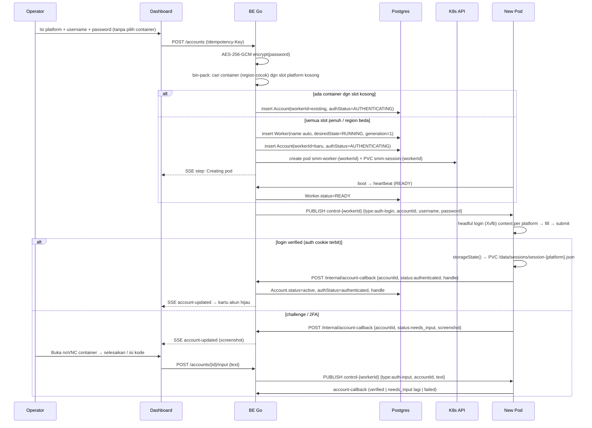
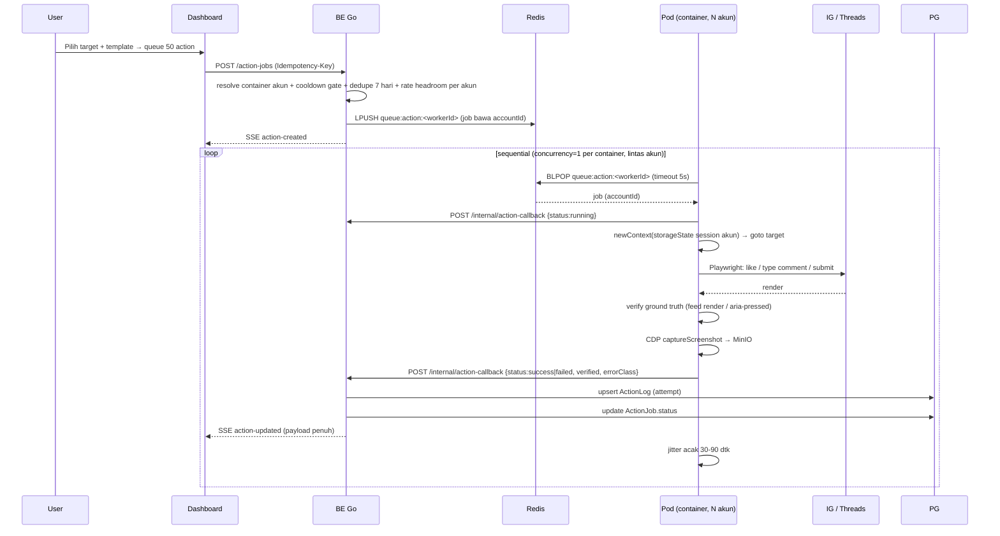

# System Design — Social Media Management

## Arsitektur Tingkat Tinggi

Pola publish-job & Action Worker mengacu pada referensi `JG/automation` (terbukti jalan): **Redis Pub/Sub untuk kontrol**, **HTTP callback untuk verdict**, **worker tidak pernah menyentuh DB**, **login interaktif headful lewat noVNC**.

```mermaid
graph LR
  subgraph FE [Frontend - Next.js 15]
    UI[Dashboard]
    SSE[SSE Client]
    VNC[noVNC iframe]
  end
  subgraph BE [Backend - Go 1.23 Echo]
    API[REST API]
    HUB[SSE Hub]
    SCHED[robfig cron]
    PROV[Provisioner]
    ORPH[Orphan Sweeper]
    PUB[Publisher]
  end
  subgraph DB [Data Layer - Container]
    PG[(Postgres + TimescaleDB)]
    RD[(Redis)]
    MN[(MinIO)]
  end
  subgraph WK [K8s - 1 Pod = 1 "device" (N akun, 1/platform) - Node.js]
    P1[Pod 1 - IG foo + Threads bar]
    P2[Pod 2 - IG baz + Threads qux]
    PN[Pod N]
    SJ[Scrape Job ephemeral]
  end
  subgraph EXT [External]
    APIFY[Apify Actors]
    PROXY[Residential Proxy]
    PLAT[IG / Threads]
  end

  UI --> API
  UI --> SSE
  UI --> VNC
  API --> PG
  API --> RD
  API --> MN
  API --> PROV
  API --> SCHED
  API --> PUB
  PROV --> K8SAPI[K8s API]
  ORPH --> K8SAPI
  SCHED --> RD
  SCHED --> PG
  PUB --> RD
  HUB --> SSE
  API --> HUB
  RD --> P1
  RD --> P2
  RD --> PN
  P1 --> PW[Playwright headful browser Xvfb]
  P2 --> PW
  PN --> PW
  P1 -->|callback HTTP| API
  P2 -->|callback HTTP| API
  PN -->|callback HTTP| API
  SJ --> APIFY
  P1 --> APIFY
  SJ --> PROXY
  P1 --> PROXY
  APIFY --> PLAT
  P1 --> MN
  P2 --> MN
  PN --> MN
```

**Jalur worker (invarian dari referensi):**

- Worker → Redis: `SUBSCRIBE` saja (dua channel: `control-<workerId>` privat + `queue:action:<workerId>` list). Satu worker = satu container = banyak akun (maks 1/platform).
- Worker → BE: HTTP callback (`POST /internal/action-callback`, `POST /internal/account-callback`, `heartbeat`) — payload bawa `accountId`. **Tidak ada** kredensial DB di container worker.
- Worker → BE: `POST /internal/session-pull` (mTLS) saat boot per platform; `GET` session tidak pernah lintas worker.
- Publikasi job: **BE satu-satunya publisher** (`PUBLISH`/`LPUSH`), worker tidak pernah publish.

### Model Transport (Hybrid)

| Jalur                                | Mekanisme                                                                        | Alasan                                                                                                                                               |
| ------------------------------------ | -------------------------------------------------------------------------------- | ---------------------------------------------------------------------------------------------------------------------------------------------------- |
| Action job                           | **Redis List durable** per container (`queue:action:<workerId>`) + `BLPOP` + ACK | Action = aksi nyata ke platform; job hilang = action hilang. Butuh durability + ordering sequential lintas akun.                                     |
| Kontrol akun (login/challenge/clear) | **Redis Pub/Sub** `control-<workerId>`                                           | Instruksi bertarget per container; kredensial tidak boleh bocor ke seluruh fleet. Fire-and-forget OK karena ada state di DB + retry manual operator. |
| Verdict worker                       | **HTTP callback** ke BE                                                          | BE satu-satunya penulis DB → satu titik validasi/sanitasi.                                                                                           |
| Real-time FE                         | **SSE** (`GET /api/stream`)                                                      | Satu arah server→browser; command dari FE lewat REST. Auto-reconnect bawaan, tanpa library.                                                          |

## Sequence — Add Account (login interaktif + provisioning)



> **MVP simplification vs referensi:** referensi menyelesaikan challenge **dua cara** — (a) isi kode via API `auth-input`, (b) operator klik di noVNC. MVP pakai keduanya: noVNC untuk challenge non-teks (captcha), `auth-input` untuk kode OTP.

## Sequence — Action (Sequential Batch + Verifikasi)



**Invarian (dari referensi, wajib dijaga):**

1. **Commit DB sebelum publish/enqueue.** Job + baris `ActionJob` `PENDING` ditulis dalam satu transaksi, baru `LPUSH`/`PUBLISH`. Dibalik → callback `jobId` tak dikenal → verdict hilang.
2. **`ActionLog` = upsert per `(actionJobId, attempt)`.** `UNIQUE KEY`. Callback `running` lalu terminal menimpa baris sama.
3. **`screenshotKey` pakai `COALESCE`** di upsert — callback `running` tanpa screenshot tidak menghapus shot sebelumnya.
4. **`PENDING` ≠ `FAILED`.** Tidak ada reaper yang menandai job lama `PENDING` jadi `FAILED`. `PENDING` = worker belum mengambil; `FAILED` = worker menjalankan & gagal. Mencampur = menghapus informasi.
5. **Verifikasi = ground truth, bukan asumsi.** Comment → teks harus muncul di feed; like → `aria-pressed`/state berubah. Gagal verifikasi → `failed`, bukan `success` palsu.
6. **Callback idempoten + retry 3× backoff `attempt×1s`; 4xx stop.** Gagal total → log, jangan bunuh worker.

## Komponen

| Komponen       | Tanggung Jawab                                                                                                                     | Stack                                                                                                                |
| -------------- | ---------------------------------------------------------------------------------------------------------------------------------- | -------------------------------------------------------------------------------------------------------------------- |
| Frontend       | Dashboard 3 persona, shadcn/ui minimalist profesional, real-time                                                                   | Next.js 15 App Router, React 19, shadcn/ui, Tailwind v4, TanStack Query, Zustand, recharts, native EventSource (SSE) |
| API            | REST + auth + business logic                                                                                                       | **Go 1.23**, Echo v4, `log/slog`, golang-jwt/v5, go-playground/validator                                             |
| DB Layer       | Type-safe query ke Postgres                                                                                                        | **pgx/v5 + sqlc** (code-gen dari `db/queries/*.sql`)                                                                 |
| Migration      | Schema Postgres                                                                                                                    | **golang-migrate** (raw SQL up/down)                                                                                 |
| SSE Hub        | Push verdict/heartbeat ke FE (server→browser)                                                                                      | Echo + `net/http` Flusher (tanpa library)                                                                            |
| Scheduler      | Cron scrape + cookie refresh + orphan sweep                                                                                        | **robfig/cron/v3**                                                                                                   |
| Provisioner    | Spawn/kill pod per akun via K8s API                                                                                                | **k8s.io/client-go**, RBAC `smm-provisioner`                                                                         |
| Publisher      | Fan-out + instruksi bertarget ke worker                                                                                            | **go-redis/v9** (`PUBLISH control-<id>`, `LPUSH queue:action:<id>`)                                                  |
| Queue          | Antrian action job (durable, sequential per akun)                                                                                  | Redis List + go-redis/v9 (producer); worker `BLPOP`                                                                  |
| Worker         | 1 container = 1 "device", host N akun (maks 1/platform); Playwright **headful** (action sequential) + Apify SDK (scrape ephemeral) | **Node.js 22** + Playwright + stealth + apify-client + Xvfb/x11vnc/noVNC                                             |
| Postgres       | State utama + time-series                                                                                                          | `timescale/timescaledb:2.14.2-pg16` (container, bukan RDS)                                                           |
| Redis          | Cache + queue action (Redis List) + Pub/Sub kontrol                                                                                | `redis:7-alpine` (container, AOF on, RDB hourly)                                                                     |
| Object Storage | Raw payload Apify, screenshot, backup WAL/RDB                                                                                      | `minio/minio` (container, erasure-coded 4 node)                                                                      |

## Data Flow

### Scrape

1. Scheduler (`robfig/cron`) atau user enqueue `ScrapeJob` via API → write Postgres + push Redis list (`queue:scrape`).
2. Node worker poll Redis → claim job → panggil Apify actor `(target, account_cookie, proxy_group_id)`.
3. Actor scrape via residential proxy → JSON.
4. Worker upload raw ke MinIO, normalisasi → `POST /internal/scrape-results` ke Go API → insert Postgres.
5. Worker heartbeat + SSE event `scrape-updated`.

### Action (Sequential Batch dalam 1 Container)

1. User pilih target + template → `ActionJob` dengan `accountId`.
2. BE **cooldown gate** (Redis `SET PX` per `(accountId,targetUrl)`) + dedupe 7 hari + cek rate headroom → tulis `ActionJob` `PENDING` (1 tx) → `LPUSH queue:action:<workerId>` (job bawa `accountId`).
3. Container `BLPOP` 1 job (concurrency = 1 per worker; tidak ada tab paralel).
3a. **Model batch**: scheduler mendistribusikan job ke maksimal `ACTION_BATCH_PARALLELISM` container (default 4) secara bersamaan — N worker jalan **paralel antar container**, **sequential di dalam** masing-masing container. Batch = knobs latency, bukan kuota: rate-limit per akun + cooldown gate tetap membatasi. Container tanpa job di batch itu tetap idle (tidak Reserve ekstra).
4. Playwright jalankan pada context baru dengan **`storageState` session** yang sudah login (persist di PVC per akun).
5. Sequential: action selesai → callback verdict → jitter acak 30-90 dtk → job berikutnya.
6. **Verifikasi ground truth**: comment → teks muncul di feed; like → state `aria-pressed` berubah. Screenshot via CDP `Page.captureScreenshot` (bukan `page.screenshot`; halaman Meta tak pernah settle).
7. Gagal → klasifikasi `error_class` → backoff eksponensial max 3 retry → healthScore −10. `< 30` → auto-quarantine + alert.

Throughput: ~1 action / 60 dtk = 60/jam per container; per batch aktif ≈ N × 60/jam (N = `ACTION_BATCH_PARALLELISM`). IG cap 30/jam per akun → headroom tetap besar.

## Tech Stack (versi target)

| Layer         | Pilih                                                                                                                             |
| ------------- | --------------------------------------------------------------------------------------------------------------------------------- |
| Runtime BE    | **Go 1.23**                                                                                                                       |
| HTTP          | Echo v4                                                                                                                           |
| DB driver     | **pgx/v5** (pool)                                                                                                                 |
| Query         | **sqlc** (code-gen dari SQL)                                                                                                      |
| Migration     | **golang-migrate**                                                                                                                |
| Auth          | golang-jwt/v5 + bcrypt                                                                                                            |
| Validator     | go-playground/validator/v10                                                                                                       |
| Logger        | `log/slog` (stdlib Go 1.21+)                                                                                                      |
| Scheduler     | robfig/cron/v3                                                                                                                    |
| Redis         | redis/go-redis/v9                                                                                                                 |
| Pub/Sub+Queue | go-redis/v9: `PUBLISH control-<id>` + `LPUSH/BLPOP queue:action:<id>` (2 client terpisah — subscriber tak bisa jalankan perintah) |
| Realtime FE   | SSE native `http.Flusher` (net/http) — tanpa library                                                                              |
| K8s client    | k8s.io/client-go                                                                                                                  |
| Trace         | OpenTelemetry-Go + otel-collector                                                                                                 |
| FE            | Next.js 15, React 19, shadcn/ui, Tailwind v4, TypeScript 5.6                                                                      |
| FE state      | TanStack Query 5, Zustand 5                                                                                                       |
| SSE client    | `EventSource` (native browser) + TanStack Query invalidation                                                                      |
| Scraping      | apify-client 2 (Node worker)                                                                                                      |
| Proxy         | Bright Data (primary), Smartproxy (failover)                                                                                      |
| Container     | Docker, K8s                                                                                                                       |
| CI            | GitHub Actions                                                                                                                    |
| Monitoring    | OpenTelemetry → Grafana + Loki                                                                                                    |

## Skalabilitas

| Fase         | Bottleneck     | Solusi                                                                                  |
| ------------ | -------------- | --------------------------------------------------------------------------------------- |
| < 100 pod    | Redis single   | OK                                                                                      |
| 100-500 pod  | Redis I/O      | Redis Sentinel (HA) atau Cluster + sharding queue per region                            |
| 500+ pod     | Postgres write | Vertical scale pod + TimescaleDB hypertable compress; chunk `MetricSnapshot` per minggu |
| Burst scrape | Apify quota    | Multi-account Apify + queue depth alarm                                                 |
| Postgres CPU | Query berat    | pg_stat_statements monitor; tambah read replica fase 2                                  |
| Storage IO   | MinIO NVMe     | Tambah node erasure-coded; managed S3 fase 2 jika cost-effective                        |
| Provisioning | K8s API rate   | Batch pod create (max 10/call); queue Redis saat burst; quota `pods` namespace 500      |

### Vertical Scale Cadangan (Postgres container)

- Default pod: 2 CPU / 4 GiB / PVC 100 GB.
- Scale up: edit StatefulSet, restart pod (downtime ~30 dtk untuk MVP).
- Fase 2: tambah pgBouncer sidecar (pool size 20) untuk kurangi koneksi overhead.

### Dynamic Worker Scale

- **Default: nol container.** Fleet mulai kosong. User **membuat container manual** dari dashboard (pilih platform → provision slot). Saat menambah akun, bin-pack ke container ber-slot-kosong; bila tak ada slot → **fallback auto-create** (bila `PROVISION_AUTO_CREATE=true`, default). Pause/Resume/Remove container dari dashboard. Tanpa redeploy BE/FE, tanpa daftar worker statis.
- Backend **tidak** menyimpan daftar worker statis. Fleet = turunan dari baris `Worker` ber-pod-hidup. `GET /containers` mengembalikan fleet aktual.
- Burst create (50 akun sekaligus): antrian Redis, rate-limit `10 create/menit` ke K8s API, fan-out reconcile per container.
- Auto-cleanup: container **`source=AUTO`** tanpa akun sama sekali → auto-delete. Container **`source=MANUAL`** bertahan (bisa di-pre-provision) sampai user Remove. Akun `dead` > 30 hari → `archived` + purge.
- HPA **tidak** dipakai untuk worker (cardinality per-container, bukan beban). HPA hanya untuk BE/FE.

## Security

- Semua endpoint BE: JWT (golang-jwt/v5) + CSRF (SameSite=strict cookie).
- `Account.credentials` + `ProxyGroup.poolKey` di-encrypt dengan KMS (envelope encryption, aws-sdk-go-v2).
- Worker → BE: mTLS (Linkerd) atau token + IP allowlist. Internal endpoint `/internal/*` hanya dari worker namespace.
- Rate limit per route: 100 req/menit per user; 1000 req/menit per IP.
- Audit log untuk: spawn/kill worker, edit template, hapus akun, manual action.
- Tidak ada plaintext credentials di log.
- Secret rotation: KMS key yearly; cookie rotate per `cookieExpiryAt` atau on-demand via dashboard.
- Idempotency-Key wajib untuk POST mutasi state (action job, kill worker, create account).
- PII: handle boleh di log; cookie/token/credential **dilarang** (CI grep gate).
- K8s RBAC: `ServiceAccount smm-provisioner` hanya `pods create,delete,get,list` di namespace `smm`.

## Observability

- Trace: OpenTelemetry-Go → Jaeger.
- Metric: Prometheus → Grafana (scrape success rate, action latency, worker heartbeat gap, proxy bytes, apify cost).
- Log: `slog` → Loki.
- Alert:
  - Worker heartbeat gap > 90 dtk.
  - Action success rate < 80% / jam.
  - Scrape 429 dari Apify > 10 / jam.
  - Daily proxy spend > 90% budget.
  - Boot timeout (pod stuck > 90 dtk).

## Resiliensi

| Failure             | Mitigasi                                                               |
| ------------------- | ---------------------------------------------------------------------- |
| Apify down          | Retry exponential backoff + alert setelah 5 menit                      |
| Proxy provider down | Failover ke provider sekunder                                          |
| Worker crash        | K8s restart, heartbeat sweeper mark `DEAD`, reconciler respawn (gen++) |
| Postgres down       | FE read dari cache Redis (60 dtk stale OK)                             |
| Redis down          | BE degradasi ke polling langsung DB (slow path)                        |
| K8s API down        | Provisioning di-queue Redis, retry saat API pulih                      |

## Container Image

- **BE (Go)**: stage build `golang:1.23-alpine`, runtime `gcr.io/distroless/static-debian12:nonroot`. Static binary, CGO off. ~20 MB.
- **FE (Next.js)**: stage deps/build, runtime `node:22-alpine` + standalone output. ~150 MB.
- **Worker (Node)**: `mcr.microsoft.com/playwright:v1.50.1-noble` + `x11vnc novnc websockify` + stealth. ~1.2 GB. Xvfb + noVNC (port 6080) untuk login headful.
- Satu image worker untuk IG & Threads — adapter dipilih via env `PLATFORM`.
- **Tidak ada kredensial di env/Dockerfile.** Cookie/session di-inject saat runtime: boot `POST /internal/cookie-pull` (mTLS) atau login interaktif via `control-<workerId>`.

### Container Hardening

- `runAsNonRoot: true`, `runAsUser: 10001`.
- `readOnlyRootFilesystem: true`, writable `/tmp` + `/data/screenshots` via emptyDir, **`/data/sessions` via PVC** (session Playwright harus persist lintas restart).
- `capabilities.drop: [ALL]`.
- `seccompProfile.type: RuntimeDefault`.
- **Resource (worker)**: `requests {cpu: 750m, memory: 1Gi}`, `limits {cpu: 2, memory: 4Gi}`. Right-sized (idle-heavy, CPU di-overcommit; memory request cukup untuk baseline, limit serap spike Chromium). Detail: `INFRA_ANALYST.md` §2.2/Q2.
- Image scan: Trivy per push; CVE high/critical block.
- Browser cache: emptyDir di `/root/.cache/ms-playwright` untuk speed restart.
- **noVNC port 6080 tidak diekspos publik** — akses via port-forward / reverse proxy ber-auth di belakang dashboard.

## Stateful vs Ephemeral

- **Stateful pod** = container per akun, long-running. Pause/resume aman. **Session Playwright persist di PVC** → restart pod tidak perlu login ulang (`storageState()` dibaca ulang saat boot).
- **Ephemeral job** = scrape K8s Job, reuse kredensial pod akun yang sama (pull dari BE by `accountId`), exit setelah selesai. Tidak menyimpan state.
- Alasan split: scrape bursty tanpa membebani persistent pod; action butuh continuity.

### K8s Provisioning (BE Go pakai `k8s.io/client-go`)

- ServiceAccount `smm-provisioner` di namespace `smm`, RBAC: `pods + pvc + service create,delete,get,list` (tanpa update) — cukup untuk create/delete, **tidak** bisa `patch` (mutasi hanya lewat recreate).
- Pod naming `smm-worker-{workerId-cuid}` (max 63 char). Labels: `app=smm-worker`, `smm.worker=<workerId>`, `smm.region=<region>`, **`smm.generation=<n>`**.
- Pod spec dari ConfigMap `smm-worker-spec`; BE substitute `WORKER_ID` + `ACCOUNT_IDS` + `PLATFORMS` + `PROXY` + `SESSION_PVC` + `GENERATION`.
- **Session:** PVC `smm-session-{workerId}` (**512 MiB**, ReadWriteOnce) → `/data/sessions` (satu file `session-<platform>.json` per akun; file hanya KB). Dibuat saat container dibuat; **PVC ditahan saat pause container**; dihapus saat container di-remove.
- Bootstrap session: pod start → mount PVC (session lama jika ada) → untuk akun tanpa session, call BE `POST /internal/session-pull {accountId}` atau tunggu `control-<workerId>` `auth-login`.
- Boot timeout 90 dtk → pod CrashLoopBackOff → BE mark `Worker.status=ERROR` + alert.
- K8s API call di-rate-limit `10 create/menit` (burst 20); burst create di-queue Redis.

### Worker Lifecycle & Desired-State Reconciler

**Sumber keinginan** = `Worker.desiredState` (container = unit provisioning). **Actual** = `Worker.containerId` + pod K8s berlabel `smm.generation`. Akun tidak lagi mengendalikan provisioning — menambah akun ke container ber-slot-kosong **tidak** membuat pod baru.

| desiredState | Aksi reconciler                                                                                       |
| ------------ | ----------------------------------------------------------------------------------------------------- |
| `RUNNING`    | Pod harus ada. Tidak ada → **create** (gen++). Ada tapi gen usang → kill lama + create.               |
| `STOPPED`    | Pod tidak boleh ada. Ada → **drain 60 dtk → delete pod**, tahan PVC. `Worker.status=DRAINING → DEAD`. |

**Transisi desiredState dari UI:**

- **Create container (manual, default):** user pilih platform → BE insert `Worker` (`desiredState=RUNNING`) → `enqueue reconcile` → pod dibuat.
- Add account → bin-pack ke container ber-slot-kosong + region cocok; bila tak ada slot → auto-create `Worker` (`desiredState=RUNNING`) **hanya bila `PROVISION_AUTO_CREATE=true`** (default); else API mengembalikan hint `NO_SLOT` agar user buat container manual.
- `PROVISION_AUTO_CREATE=false` → fleet murni manual (cocok bila user ingin kontrol penuh atas jumlah device).
- Remove container → `Account.status=archived` (semua akunnya) → DELETE pod + PVC.
- Pause/Resume container → toggling `Worker.desiredState`.
- **Container `source=AUTO` tanpa akun** → reconciler auto-delete. Container **`source=MANUAL`** tanpa akun **tidak** dihapus (pre-provision).

**Dua pemicu reconcile** (bukan cuma cron):

1. **Event-driven** (jalur utama): Add/Remove akun, Pause/Resume container dari API → tulis desired-state → `enqueue reconcile(workerId)` → reconcile segera. Latensi ≈ detik.
2. **Periodic safety-net** (`robfig/cron`, tiap 60 dtk): full-scan desired vs actual — tutup gap bila event hilang (BE restart, Redis hiccup).

**Idempotensi & anti-spawn-ganda** (pengganti `SETNX`):

- Tiap apply menaikkan `Worker.generation`; pod dilabeli `smm.generation=<n>`; worker ACK → `observedGen=n`.
- Reconcile dengan generation sama = **no-op** (idempotent) — retry/duplicate event aman.
- Pod dgn generation **lebih tua** dari `observedGen`, atau pod kedua untuk `(workerId, generation)` sama → **orphan** → delete yang lebih tua. K8s jadi lock-nya.
- Semua keputusan CREATE/DELETE ditulis ke `ProvisionLog` (op, generation, hasil, error).

**Boot sequence pod** (state machine): `PENDING`(create) → `READY`(semua sesi platform siap) → `IDLE`/`BUSY`(job) → `DRAINING`(SIGTERM) → `DEAD`. `ERROR` bila boot timeout. Sumber: heartbeat `POST /internal/heartbeat`.

### Anti-flapping & Health Sweep

- Pod tanpa heartbeat > 90 dtk → heartbeat sweeper mark `DEAD`; reconciler event-driven respawn (generation++).
- Anti-flapping: max 3 restart / 10 menit per **container**; lebih → `Worker.status=quarantined` (butuh manual reset via UI). Akun di dalamnya ditandai `quarantined` juga.
- Reconcile loop **tidak** menyentuh `ActionJob` (itu urusan job reaper terpisah — lihat Worker Rule).

## Capacity Planning (MVP — IG + Threads, 100+ akun, ~50 container)

> Analisis menyeluruh (sizing node, storage kapasitas, jaringan, HA/DR, biaya, risiko) → lihat `INFRA_ANALYST.md`.

- 100+ akun → **~50 container** (1 container = 2 akun: 1 IG + 1 Threads). Bin-packed otomatis dari UI.
- Pod size worker: request 750m CPU / 1 GiB, limit 2 CPU / 4 GiB (headful Chromium + Xvfb + noVNC; idle-heavy).
- Throughput per container: ~1 action / 60 dtk = 60/jam (serial lintas akun). Rate limit per akun (IG 30/jam, Threads 15/jam) tetap terjaga → headroom besar.
- Total sistem: ~3000 action/jam @ 50 container.
- Proxy bandwidth: per-akun 200 MB/hari; total ~100×50 MB/hari = 5 GB/hari ≈ $75/hari (residential).
- Postgres row growth: `MetricSnapshot` ~100k/hari → ~3M/bulan → TimescaleDB compress setelah 7 hari.
- Redis: ~5k job in-flight × 2 KB = 10 MB.

> **Naikkan `MAX_ACCOUNTS_PER_CONTAINER`** (env, `Setting`) saat tambah platform — container sama bisa host s.d. 7 akun (1/platform). Blast radius naik proporsional: 1 pod mati = N akun idle. Matriks kapabilitas & rollout 7 platform: `PLATFORM_MATRIX.md`.

### Monthly Cost Rollup (semua self-hosted container)

| Item                                            | Estimasi/bulan    |
| ----------------------------------------------- | ----------------- |
| Compute (~50 worker pod, 2 vCPU)                | $400              |
| Compute (3 BE + 3 FE pod)                       | $80               |
| Node data (Postgres + Redis + MinIO, NVMe 1 TB) | $200              |
| Proxy residential (150 GB)                      | $2,250            |
| Apify actor compute                             | $200              |
| Bandwidth egress (~2 TB)                        | $160              |
| Observability (Grafana Cloud free + Loki)       | $0–$50            |
| **Total infra**                                 | **~$3,340/bulan** |

Trade-off vs managed (RDS/ElastiCache/S3): hemat ~$500/bulan, tapi carry operasional DB/Redis/MinIO (~0.5 FTE bulan pertama → 0.2 FTE setelah runbook matang).

## Deployment

### Prinsip: Semua Containerized

Semua workload (BE Go, FE Next.js, Worker Node, Postgres+TimescaleDB, Redis, MinIO) berjalan sebagai container. Tidak ada managed service eksternal di MVP. Trade-off: lebih murah, full control, dev parity tinggi; operasional DB/Redis ditanggung sendiri. Migrasi managed service dipertimbangkan fase 2 (pod > 500 atau butuh HA multi-region).

### Image Registry

- `ghcr.io/<org>/smm/<service>:<sha>` (immutable per commit); tag `:main` untuk staging.
- Trivy scan di CI; CVE high/critical block.

### Local Dev: docker-compose

Stack lengkap didefinisikan di `compose.yaml` (root repo). Prinsip: **runtime OrbStack**, semua service container, **tanpa K8s**. Port host memakai range **24xxx** agar tidak bertabrakan dengan project lain di mesin yang sama.

Port host: API `24080`, web `24081`, Postgres `24543`, Redis `24637`, MinIO `24900`/console `24901` (override via `infra/docker/.env.example` → `.env`).

Service: `postgres` (TimescaleDB), `redis`, `minio` + `minio-init` (buat bucket `raw-payload`/`screenshots`/`sessions`), `migrate` (golang-migrate, one-shot), `api` (Go, distroless, `healthcheck` subcommand), `worker` (di-`--scale`), `web` (Next.js standalone).

Worker image = **Chromium-only** (`node:22-bookworm` + `playwright install --with-deps chromium`), bukan base Playwright full (3 browser) — hemat ~1.5 GB. Xvfb + x11vnc + noVNC ada di image untuk login headful; `WORKER_ID` **diturunkan dari hostname** oleh entrypoint (bukan env statis) sehingga `--scale worker=N` menghasilkan channel/queue unik per replica.

```sh
make up            # docker compose up -d --scale worker=3
make logs S=api    # tail satu service
make down          # stop (volume dipertahankan)
```

### Local Tier (Mac M2 16 GB) — docker-compose via OrbStack, tanpa K8s

Lingkungan build/dev = **lokal Mac M2 16 GB**, container runtime = **OrbStack** (bukan Docker Desktop — OrbStack lebih hemat RAM/CPU di Apple Silicon dan berbagi network dengan host sehingga `localhost` bekerja tanpa config). K8s (k3s + desired-state reconciler) adalah **jalur produksi**; di lokal "worker dinamis" disimulasikan dengan **`--scale`**.

- **OrbStack:** set VM limit (~8 GiB RAM) di OrbStack → Settings; aktifkan *"Start at login"*. Domain `*.orb.local` tersedia untuk akses service antar-container (opsional; compose network sudah cukup).

- **Scale worker:** `docker compose up -d --scale worker=3` (maks **3** di M2 16 GB; lihat `INFRA_ANALYST.md` §15.2). Tiap replica butuh `WORKER_ID`/`CONTROL_CHANNEL`/`ACTION_QUEUE` unik → pakai `container_name` template atau entrypoint yang derive `WORKER_ID` dari `hostname`. Named volume `sessions-<workerId>` menggantikan PVC per container.
- **Tanpa reconciler K8s:** provisioner (`k8s.io/client-go`) berjalan **hanya bila** `PROVISIONER_MODE=k8s`. Di lokal set `PROVISIONER_MODE=static` → BE tak memanggil K8s API; daftar worker dibaca dari baris `Worker` yang di-seed. Semua **logika bisnis** (bin-packing, rate-limit, batch, verdict, health-score) tetap sama — hanya backend provisioning yang berbeda.
- **ARM64:** pin image multi-arch (Playwright `*-noble` arm64, `timescale/timescaledb` arm64, `minio/minio` arm64, `redis:7-alpine` multi-arch). Base image worker wajib arm64 atau `--platform=linux/arm64`.
- **`ACTION_DRY_RUN=true` (default di lokal):** worker menjalankan Playwright sampai *sebelum* commit aksi (navigasi + screenshot + verdict disimpan, **tidak** benar-benar submit comment/like/report). Wajib untuk dev tanpa membakar akun. Set `false` hanya saat uji aksi nyata dengan akun throwaway.
- **Proxy egress** tetap aktif walau lokal (worker → IG/Threads) — tanpa proxy, akun uji cepat kena challenge/ban.
- **Apify** scrape jalan di cloud → tidak membebani Mac.

### Production K8s

- **BE (Go)**: 3 replica Deployment (distroless). SSE = HTTP biasa → sticky session tidak wajib; Ingress `proxy-buffering: off` + `X-Accel-Buffering: no`. Init container `migrate` (golang-migrate up) sebelum app start.
- **FE (Next.js)**: 3 replica Deployment, standalone output, di belakang Ingress.
- **Worker**: replicas **dinamis** per container — spawn via K8s API dari BE Provisioner. PDB `minAvailable: 50%`.
- **Postgres+TimescaleDB**: StatefulSet 1 replica MVP. PVC 100 GB expandable. WAL archive → MinIO bucket `pg-wal`.
- **Redis**: StatefulSet 1 replica MVP. PVC 5 GB. RDB+AOF on.
- **MinIO**: StatefulSet 4 node erasure-coded. PVC 500 GB total. Bucket `smm` single-tenant.
- **Node pool**:
  - `smm-app`: taint `smm-app=true:NoSchedule`. BE + FE (256m/256Mi).
  - `smm-worker`: taint `smm-worker=true:NoSchedule`. 1 node 16 vCPU/32 GB = 16-30 worker pod.
  - `smm-data`: taint `smm-data=true:NoSchedule`. NVMe node untuk Postgres+Redis+MinIO.
- **NetworkPolicy** (default deny):
  - FE → BE (8080).
  - BE → Postgres (5432), Redis (6379), MinIO (9000), K8s API (443).
  - Worker → BE (8080), Redis (6379), MinIO (9000).
  - BE → Worker: tidak (worker panggil BE, bukan sebaliknya).
- **CI/CD**: trunk-based; deploy main → staging otomatis; prod manual promote via GitHub Actions `workflow_dispatch`.

## Backup & Disaster Recovery

- Postgres: `pg_basebackup` harian + continuous WAL archive ke MinIO `pg-wal` (retention 7 hari).
- Redis: RDB snapshot tiap jam ke MinIO `redis-rdb` + AOF on. Retention 7 hari.
- MinIO: versioning on per bucket. Lifecycle: `raw-payload` → Glacier 90 hari, `screenshots` → Glacier 30 hari, `pg-wal`/`redis-rdb` → hapus 30 hari.
- Backup verify: harian `pg_restore` ke Postgres ephemeral di staging; alert jika gagal.
- Recovery target: RPO 5 menit (WAL archive), RTO 30 menit (single region MVP).
- Cookie + KMS key: backup terenkripsi di MinIO bucket terpisah; restore via `infra/runbooks/dr-cookie-restore.md`.
- Quarterly DR drill: restore Postgres + Redis di namespace terpisah, verify app boot.
