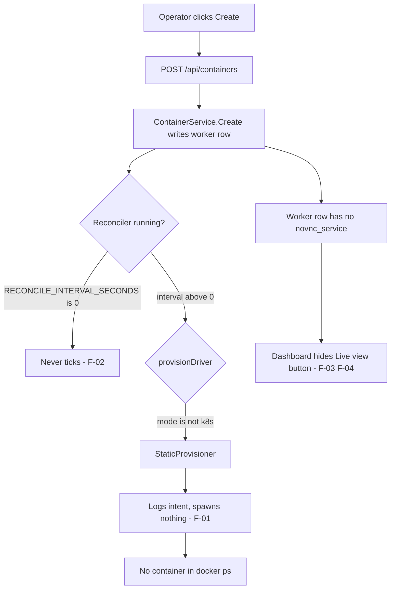

# Audit report — container provisioning and noVNC live view (local tier)

**Date** 2026-09-18 · **Revision audited** `main` @ `d1793cb` plus the
working-tree edit to `apps/api/internal/config/config.go` · **Auditor** NEXA AI

Scope: the whole repository (`apps/api`, `apps/worker`, `apps/web`, `infra`,
`compose.yaml`, `docs/`) audited against the operator-reported symptoms below.
Severity labels follow [SEVERITY.md](SEVERITY.md).

## 1. Why this audit ran

| #   | Operator report                                                                               | Verdict                              |
| --- | --------------------------------------------------------------------------------------------- | ------------------------------------ |
| S1  | "aku create Container tidak tercreate" — nothing appears in `docker ps` after clicking Create | **Confirmed.** Caused by F-01 + F-02 |
| S2  | "mana untuk noVNC nya? kenapa tidak ada button untuk view noVNC nya?" — needed for OTP/2FA    | **Confirmed.** Caused by F-03 + F-04 |
| S3  | Custom host port for the noVNC live view                                                      | **Not implemented.** F-05            |
| S4  | "by default tidak ada container worker saat data masih kosong"                                | **Regressed.** F-08                  |

## 2. Root cause map

Every path from "Create" to "a container exists" is broken today. Nothing below
is suspected: each finding was read out of the source.

## 3. Findings

### F-01 — BLOCKER — `PROVISIONER_MODE=docker` degrades silently to a no-op

`apps/api/cmd/server/main.go` `provisionDriver()` decides with
`if cfg.ProvisionerMode != "k8s"`. Any other value — including the `docker`
that `apps/api/internal/config/config.go` documents and validates as legal —
returns `adapter.NewStaticProvisioner`. That driver's `CreateWorker`
(`apps/api/internal/adapter/static_provisioner.go`) logs
`"static provisioner: no cluster, recording intent"` and returns `nil`.

There is no `internal/adapter/docker*` package. The k8s driver is the only real
implementation of `port.K8sClient` (`apps/api/internal/port/worker.go`).

**Impact.** Create writes a row plus an "applied" audit record, answers `201` to
the dashboard, and provisions nothing. This is report S1.

### F-02 — BLOCKER — the reconciler never runs in the local tier

`RECONCILE_INTERVAL_SECONDS` defaults to `0` (`config.go`), `compose.yaml` never
sets it, and `main.go` starts the reconciler only when it is `> 0`. Provisioning
is the reconciler's job (`service/reconciler.go` → `driver.CreateWorker`), so
even a correct docker driver would never be called.

`compose.yaml` also pins `PROVISIONER_MODE: ${PROVISIONER_MODE:-static}` and
`infra/docker/.env.example` ships `PROVISIONER_MODE=static`, so the default
local configuration is the no-op pair.

### F-03 — BLOCKER — the worker can never produce a noVNC URL under compose

`apps/worker/src/core/config.ts` `parseNovncUrl()` returns the value of
`NOVNC_URL`, else `NOVNC_BASE_URL` + `NOVNC_PORT`, else `null`. The file's own
comment states the container cannot discover its published host port.

`compose.yaml` passes `NOVNC_URL: ${WORKER_NOVNC_URL:-}` and
`NOVNC_BASE_URL: ${WORKER_NOVNC_BASE_URL:-}`, and `.env.example` leaves both
empty, while the worker service publishes `'6080'` — Docker's short syntax for
"assign a random free host port". The worker therefore reports `null`.

The chain is otherwise intact and was verified end to end:

- `core/heartbeat.ts` sends `novncUrl`.
- `http/internal.go` `heartbeat()` copies it into `HeartbeatRecord.NovncURL`.
- `service/job.go` `RecordHeartbeat()` sets `WorkerSnapshot.NovncURL`.
- `repository/worker.go` stores it via `TouchWorkerHeartbeat`
  (`novnc_service = $7`).
- `service/container.go` `toContainerView()` maps it to `ContainerView.NovncURL`.
- `http/container.go` `toContainerResponse()` exposes it as `novncUrl`.

**Impact.** `worker.novnc_service` stays `NULL`. Confirmed against the live row
`coba jakarta 1` with `psql`.

### F-04 — HIGH — hiding the button is the wrong failure mode

`apps/web/app/(dashboard)/workers/page.tsx` renders the Live view button inside
`{c.novncUrl ? (…) : null}`. An unpublished worker shows nothing at all, so the
operator cannot distinguish "live view disabled" from "this build has no live
view". The operator's actual job here is OTP/2FA confirmation, which requires a
clickable screen — a silently missing control costs a support round-trip.

### F-05 — HIGH — no custom host port, and no port allocation at all

`openapi/openapi.yaml` `CreateContainerRequest` accepts only `name`, `region`
and `location`; `service/container.go` `Create()` matches. There is no port
field, no port range configuration, and no allocator. Publishing is only ever
Docker's random `'6080'` binding, which is unknowable from inside the container
(F-03).

### F-06 — HIGH — the non-root distroless API cannot open the Docker socket

`apps/api/Dockerfile` ends with `USER nonroot:nonroot`. A local Docker driver
needs `/var/run/docker.sock`, which is normally `root:docker 0660`. Without a
`user:`/`group_add:` override the driver gets `EACCES` and every create fails.

### F-07 — MEDIUM — provisioning progress is invisible per container

`provision_log` exists and `service/logging_driver.go` writes to it, but no
endpoint or card surfaces it, so a `PENDING` card gives the operator no reason.
[DEVELOPMENT_PHASE.md](DEVELOPMENT_PHASE.md) promises real-time create feedback.

### F-08 — MEDIUM — `make up` always starts 3 workers, against the stated requirement

`Makefile` runs `docker compose up -d --scale worker=3`. The operator's rule is
the opposite: no worker containers while the data is empty, and containers are
created manually from the dashboard. `--scale worker=3` also fights option A
below, since dashboard-created containers appear in addition to those replicas.

### F-09 — MEDIUM — the orphan sweeper is inert in the local tier

`StaticProvisioner.ListRunning()` returns every `Worker` row's ID, while
`service/orphan_sweeper.go` compares that list against the same rows. Every ID is
always "known", so no orphan is ever observed. Harmless today; it becomes real
once F-01 is fixed and containers derive from labels.

### F-10 — MEDIUM — documentation drift

| Doc                      | Claim                                                   | Reality                                                 |
| ------------------------ | ------------------------------------------------------- | ------------------------------------------------------- |
| `DEVELOPMENT_RULE.md` §8 | `PROVISIONER_MODE={static\|k8s}`                        | Config also accepts `docker` (`config.go`)              |
| `ERD.md`                 | `novncService` = in-pod ClusterIP service, never public | Local tier must publish a host port for the browser     |
| `INFRA_ANALYST.md` §7    | noVNC never published                                   | Local dev publishes it on `127.0.0.1`                   |
| `MANUAL_TESTING.md`      | live view "needs `WORKER_NOVNC_URL`… skip if unset"     | Now a first-class create-time parameter                 |
| `SECURITY_REVIEW.md`     | noVNC published per-replica with no VNC password        | Still true, and now with an explicit local-only binding |

### F-11 — LOW — misleading runtime env on the web service

`compose.yaml` builds the web image with `NEXT_PUBLIC_API_URL=http://localhost:24080`
(build arg) but sets `NEXT_PUBLIC_API_URL=http://localhost:8080` in the runtime
`environment:`. `NEXT_PUBLIC_*` are inlined at build time, so the runtime value
is inert — but it is a trap for the next reader.

### F-12 — LOW — `.env.example` cannot express a working live view

The comments tell the operator to hand-write one URL per replica. That is not
automatable at scale and is the documented root of S2.

## 4. Verified working

Audited and found correct; no change proposed.

- Claim handshake: `core/claim.ts` → `POST /internal/claim` → `JobService.Claim`
  → `repository/worker.go` `claimBind`. `d1793cb` made `PENDING` rows reach
  `READY`; verified with `--scale worker=1/2/3`.
- Heartbeat plumbing for `novncUrl` (F-03 enumerates every hop).
- Credential encryption at rest, JWT issuance, refresh-session rotation and the
  audit middleware.
- Action transport contract: Redis list publish, HTTP callback verdict, worker
  never touching the DB ([ADR 0011](adr/0011-worker-redis-pubsub-callback-contract.md)).
- Geolocation: the API freezes one coordinate per worker and returns it through
  the claim response for Playwright to spoof.
- SSE fan-out (`ADR 0010`) for `provision-updated` and `worker-health`.

## 5. What the fix must not break

- `port.K8sClient` stays the single provisioning seam (`ADR 0012`); the docker
  driver is a peer of the k8s driver, not a special case in the services.
- noVNC is **never** published beyond loopback in the local tier, and stays
  ClusterIP-only in the k8s tier.
- `PROVISIONER_MODE=k8s` remains the production path and must be untouched.
- Every commit lands on the existing history without rewriting it.

## 6. Open decisions

| #   | Decision                              | Proposed default                                                                                                                  |
| --- | ------------------------------------- | --------------------------------------------------------------------------------------------------------------------------------- |
| D-1 | How the API reaches the Docker daemon | Mount `/var/run/docker.sock`; run the API as root **in the local compose tier only**, with the socket-proxy upgrade path recorded |
| D-2 | Host port range for the live view     | `24100–24299`, bound to `127.0.0.1`                                                                                               |
| D-3 | Who allocates the port                | `ContainerService` at create time, persisted in the existing `novnc_service` column as a URL — no migration needed                |
| D-4 | Fate of the `worker` compose service  | Behind a `profiles:` opt-in; `make up` scales it to 0                                                                             |

The remediation plan that follows from these findings is
[REMEDIATION_PLAN.md](REMEDIATION_PLAN.md).
