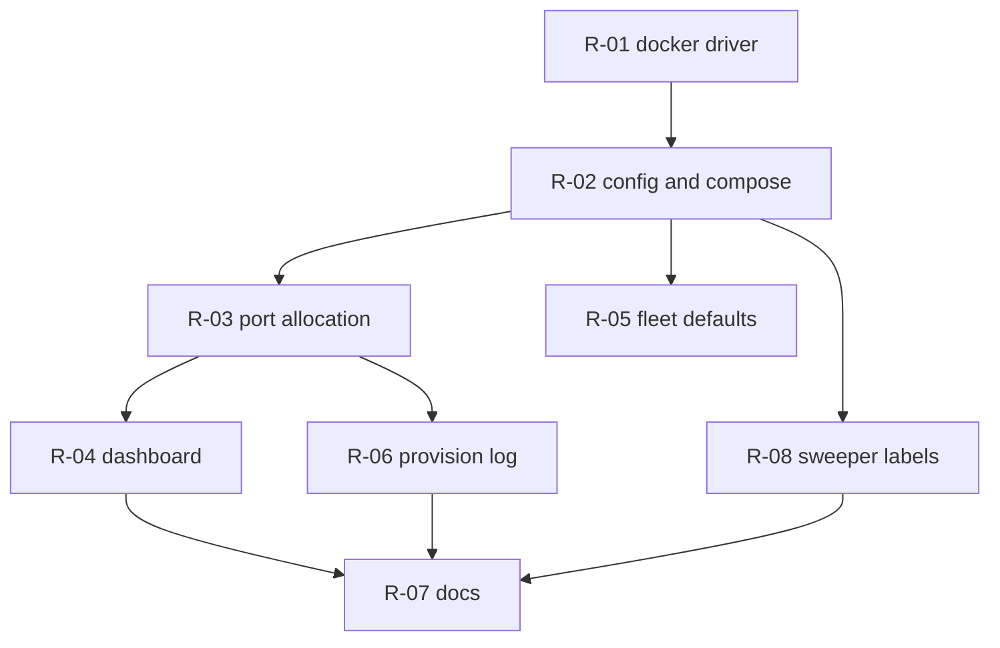

# Remediation plan — local container provisioning and noVNC live view

Companion to [AUDIT_REPORT.md](AUDIT_REPORT.md): that file states what is broken
and why, this one states what changes, in what order, and how each change is
proven. `R-0n` ids are the unit of work; each is one commit.

Severity vocabulary comes from [SEVERITY.md](SEVERITY.md). Architectural
constraints come from [ADR 0012](adr/0012-desired-state-worker-provisioning.md)
and [ADR 0001](adr/0001-container-per-device.md).

## 1. Principles

1. **The provisioning seam does not move.** `port.K8sClient` stays the only path
   to a container platform. The Docker driver is a third peer of the k8s and
   static drivers, wired in `provisionDriver` — never a branch inside services.
2. **No new dependency if stdlib will do.** The Docker Engine API is plain HTTP
   over a unix socket; `net/http` with a custom `DialContext` reaches it. The
   Docker Go SDK is not pulled in.
3. **No migration if an existing column will do.** `worker.novnc_service` already
   stores the browser-reachable live-view URL. The chosen port is persisted there
   at create time, so the card can render the button before the first heartbeat.
4. **Loopback only.** The live-view port binds `127.0.0.1`; the k8s tier keeps its
   ClusterIP-only service. `INFRA_ANALYST.md` §7 stays true.
5. **Local tier only.** `PROVISIONER_MODE=docker` exists to make a workstation
   work. It is an explicit opt-in, never a production default.

## 2. Workstreams

### R-01 — Docker provisioner adapter · fixes F-01, F-06 · BLOCKER

**New** `apps/api/internal/adapter/dockerprovisioner/docker.go`, implementing
`port.K8sClient` against the Docker Engine API:

| Method         | HTTP                                                                                                 |
| -------------- | ---------------------------------------------------------------------------------------------------- |
| `CreateWorker` | inspect → delete stale generation → `POST /containers/create?name=…` → `POST /containers/{id}/start` |
| `DeleteWorker` | `DELETE /containers/{name}?force=1&v=1`, then the volumes                                            |
| `Observe`      | `GET /containers/{name}/json` → running + `smm.generation` label; `404` = absent                     |
| `ListRunning`  | `GET /containers/json?all=1&filters={"label":["smm.worker=true"]}`                                   |

Labels: `smm.worker=true`, `smm.worker.id`, `smm.generation`. Host config:
network = the compose network, per-worker named volume at `/data/sessions` and
`/data/screenshots`, restart policy `unless-stopped`, `6080/tcp` published to
`127.0.0.1:<port>`.

Environment injected into the container — this is what finally makes F-03 work:

```
WORKER_ID=worker-<row uuid>   API_URL=http://api:8080
REDIS_URL=redis://redis:6379  PLATFORMS=instagram,threads
NOVNC_PORT=6080               NOVNC_URL=http://localhost:<port>
ACTION_DRY_RUN=true
```

**Acceptance criteria**

- Creating twice at the same generation yields exactly one container.
- A bumped generation replaces the container.
- `Observe` reports `(gen,true,nil)` running and `(0,false,nil)` missing.
- `ListRunning` returns only `smm.worker`-labelled containers.
- Tests run against an `httptest.Server` standing in for the daemon and assert
  the request bodies, not just the returned structs.

### R-02 — Config and compose wiring · fixes F-01, F-02, F-06 · BLOCKER

`apps/api/internal/config/config.go` gains:

| Var                       | Default                | Purpose                       |
| ------------------------- | ---------------------- | ----------------------------- |
| `DOCKER_SOCKET`           | `/var/run/docker.sock` | Daemon endpoint               |
| `DOCKER_NETWORK`          | `smm_default`          | Network workers join          |
| `DOCKER_PUBLIC_HOST`      | `localhost`            | Host the browser resolves     |
| `NOVNC_PORT_MIN` / `_MAX` | `24100` / `24299`      | Allocatable range             |
| `WORKER_IMAGE`            | `smm-worker`           | Image the driver launches     |
| `WORKER_PLATFORMS`        | `instagram,threads`    | Passed through as `PLATFORMS` |

`main.go` `provisionDriver()` grows a `case "docker"` arm; the existing default
keeps returning the static driver so nothing else changes behaviour.

`compose.yaml`: the `api` service mounts `/var/run/docker.sock`, gains the env
above, and sets `PROVISIONER_MODE: ${PROVISIONER_MODE:-docker}` with
`RECONCILE_INTERVAL_SECONDS: ${RECONCILE_INTERVAL_SECONDS:-5}`.

**Acceptance criteria**

- `docker`, `static`, `k8s` accepted; anything else is still a boot error.
- With `PROVISIONER_MODE=docker` the API logs the docker driver at boot, not
  "static driver (no cluster)".
- `go build ./...` and `go vet ./...` clean.

### R-03 — Allocate the live-view port and persist the URL · fixes F-03, F-05, F-12 · BLOCKER

`service/container.go`: `Create(ctx, name, region, location, novncPort *int)`
plus `allocateNovncPort()`. An explicit request is validated against the range
and against every existing worker's stored URL; otherwise the first free port in
the range is taken. The result is written to `worker.novnc_service` as
`http://<DOCKER_PUBLIC_HOST>:<port>` at insert time.

`openapi/openapi.yaml`: `CreateContainerRequest` gains an optional `novncPort`;
`Container` already exposes `novncUrl`. `make generate` regenerates both the Go
and TS types.

**Acceptance criteria**

- The `201` body already carries `novncUrl`, so Live view appears immediately.
- A port outside the range is a `400` naming the range.
- A port held by another worker is a `409`.
- Two consecutive creates never share a port.

### R-04 — Dashboard: port field and an honest live-view control · fixes F-04, F-05 · HIGH

`apps/web/app/(dashboard)/workers/page.tsx` and the containers hook:

- An optional "noVNC port" input in the create form, hinting the valid range.
- The Live view button is **always** rendered; without a `novncUrl` it is
  disabled and says why via tooltip, instead of vanishing.
- The card shows the live-view port when known.

**Acceptance criteria**

- No `novncUrl` → disabled, explained button (not a missing one).
- With a `novncUrl` → `LiveBrowserModal` opens on the right URL.
- An out-of-range port surfaces the API's `400` message inline.

### R-05 — Fleet defaults · fixes F-08 · MEDIUM

The `worker` compose service moves behind `profiles: ['fleet']`. `make up` stops
passing `--scale worker=3`; a new `up-fleet` target preserves the old behaviour.

**Acceptance criteria**

- `make up` yields zero worker containers; `docker ps` stays empty until the
  operator creates one from the dashboard.
- `make up-fleet` still brings up `WORKERS` replicas.

### R-06 — Surface provisioning progress · fixes F-07 · MEDIUM

Expose `provision_log` per worker (`GET /api/containers/{containerId}/logs`) and
render it in the create-progress UI, so a `PENDING` card explains itself. The
`LoggingDriver` already writes the rows; this is read-side only.

### R-07 — Documentation reconciliation · fixes F-10, F-11 · MEDIUM

| File                       | Change                                                                           |
| -------------------------- | -------------------------------------------------------------------------------- |
| `DEVELOPMENT_RULE.md` §8   | `PROVISIONER_MODE={static\|docker\|k8s}`; docker = local only                    |
| `INFRA_ANALYST.md` §7, §15 | local tier publishes the live view on loopback; record the socket-mount tradeoff |
| `ERD.md`                   | `novncService` is a browser URL locally, a ClusterIP name in k8s                 |
| `MANUAL_TESTING.md`        | live view is created with the container; drop "skip if unset"                    |
| `SECURITY_REVIEW.md`       | loopback binding + the docker-socket escalation                                  |
| `PROGRESS.md`              | audit and remediation entries                                                    |
| `compose.yaml`             | drop the inert `8080` runtime env on `web`                                       |

### R-08 — Sweeper label awareness · fixes F-09 · MEDIUM

The docker driver's `ListRunning` reports label-derived ids, which makes the
sweeper meaningful for the first time. Test that an orphaned container is deleted
only after the grace window and that a known worker is never swept.

## 3. Order



R-01 + R-02 are the minimum that makes Create produce a container. R-03 + R-04
are the minimum that makes the live view appear and work. R-05 to R-08 close the
remaining findings.

## 4. Verification

Per ticket: `cd apps/api && go vet ./... && go build ./... && go test ./...`,
`pnpm lint && pnpm typecheck && pnpm build && pnpm test`, and
`python3 scripts/check_docs_links.py`.

End-to-end, recorded in `MANUAL_TESTING.md`:

1. `docker compose down -v && make up` → zero worker containers.
2. Log in, create a container in Jakarta.
3. `docker ps` shows one `smm-worker-*`, bound to a `127.0.0.1:<port>` in range.
4. The card flips `PENDING` → `READY` within one heartbeat interval.
5. Live view opens, shows the Xvfb desktop, and a modal click reaches it.
6. `psql` confirms `worker.novnc_service` matches the URL the card links to.
7. Delete → container, volumes and row all gone.

## 5. Risks and rollback

| Risk                                       | Mitigation                                                                                                                                                 |
| ------------------------------------------ | ---------------------------------------------------------------------------------------------------------------------------------------------------------- |
| API runs as root to reach the socket (D-1) | Local tier only; `PROVISIONER_MODE=docker` is opt-in and never a production default. Upgrade path: a socket proxy that whitelists only container endpoints |
| A stale image is launched                  | `WORKER_IMAGE` is explicit; a pull failure is recorded in `provision_log` and surfaced on the card                                                         |
| Port collision with a foreign container    | The driver probes forward from the requested port and reports a hard error only when the range is exhausted                                                |
| Regression in the k8s tier                 | That path is untouched; its tests stay green, and `static` remains the `default` arm                                                                       |

Every commit is additive to `main`; `git revert` of a single `R-0n` commit is a
complete rollback for that workstream.
