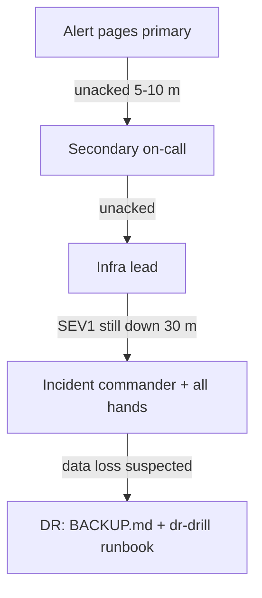

# Severity matrix and on-call expectations

Severity levels for MVP-1-SMM, the alerts that map to each, and the response
SLAs the on-call engineer is held to. Every alert below has a runbook in
[`infra/runbooks/`](../infra/runbooks/README.md) — the runbook is the
MTTR tool, this file is the contract.

Local runtime is colima + docker compose (no Kubernetes): the `make` targets and
`docker compose` commands in the runbooks are the real interface. In production
the same runbooks apply with the k8s equivalents from `INFRA_ANALYST.md`.

## Severity definitions

| Level | Meaning                                              | Ack  | Mitigate | Resolve | Escalate if unacked |
| ----- | ---------------------------------------------------- | ---- | -------- | ------- | ------------------- |
| SEV1  | Total outage or data loss. No actions run / no login | 5 m  | 30 m     | 4 h     | 5 m                 |
| SEV2  | Major feature degraded; a data plane is at risk      | 10 m | 1 h      | 1 day   | 10 m                |
| SEV3  | Partial degradation; a workaround exists             | 1 h  | 4 h      | 3 days  | 1 day               |
| SEV4  | Cosmetic / noise / capacity trend. No user impact    | 1 d  | —        | 1 week  | —                   |

- **Ack** = human has seen the page and said so in the incident channel.
- **Mitigate** = the bleeding stops (traffic restored, data loss halted), not
  necessarily root-caused.
- **Resolve** = the runbook's verification passes and the alert is closed.

The platform's hard DR target is **RTO 30 m / RPO 5 m** for the Postgres plane
(see [BACKUP.md](BACKUP.md)); a SEV1 restore must stay inside that.

## Severity mapping

| Alert / condition                                  | Sev  | Runbook                                             |
| -------------------------------------------------- | ---- | --------------------------------------------------- |
| Postgres healthcheck failing                       | SEV1 | [postgres-unhealthy](../infra/runbooks/postgres-unhealthy.md) |
| API healthcheck failing (`/healthz`)               | SEV1 | [api-unhealthy](../infra/runbooks/api-unhealthy.md) |
| Redis healthcheck failing (actions stop)           | SEV1 | [redis-unhealthy](../infra/runbooks/redis-unhealthy.md) |
| Worker auth session lost on all workers             | SEV2 | [worker-auth-failure](../infra/runbooks/worker-auth-failure.md) |
| Worker heartbeat budget exhausted / crashloop      | SEV2 | [worker-crashloop](../infra/runbooks/worker-crashloop.md) |
| API readiness `degraded` (a dependency check down)  | SEV2 | [api-readiness-degraded](../infra/runbooks/api-readiness-degraded.md) |
| Reconciler drift: desired state not applied         | SEV2 | [reconciler-drift](../infra/runbooks/reconciler-drift.md) |
| MinIO healthcheck failing (scrapes/evidence break)  | SEV2 | [minio-unhealthy](../infra/runbooks/minio-unhealthy.md) |
| Mention spike > 3x baseline, critical tier          | SEV2 | [alert-mention-spike](../infra/runbooks/alert-mention-spike.md) |
| Backup failed (RPO at risk)                         | SEV2 | [backup-failure](../infra/runbooks/backup-failure.md) |
| Views drop > 50% / 24h                              | SEV3 | [alert-views-drop](../infra/runbooks/alert-views-drop.md) |
| Rate-limit budget exhausted (actions gated)         | SEV3 | [rate-limit-exhausted](../infra/runbooks/rate-limit-exhausted.md) |
| Cooldown gate stuck (no action dispatch)            | SEV3 | [cooldown-stalled](../infra/runbooks/cooldown-stalled.md) |
| DR drill overdue / failed                           | SEV3 | [dr-drill](../infra/runbooks/dr-drill.md)            |

## On-call expectations

### Rotation

- **Primary on-call** carries the pager 7 days; **secondary** is the backup and
  takes over if the primary does not ack inside the escalation window.
- Rotation is weekly, handoff Monday 10:00 local; the outgoing primary writes
  one paragraph of open follow-ups into the runbook index.
- The current rotation lives next to the deployment notes, not in this file —
  this file defines the contract only.
- On-call is *not* feature work: the role is to ack, to run the runbook, and to
  write the post-mortem prompt into the incident.

### What "ack" means

1. Page seen → post `ack` + the runbook link in the incident channel.
2. Open the runbook and run the **Diagnosis** commands in order; they are
   written to be copy-pasteable and to identify the root cause in under
   5 minutes.
3. If diagnosis is inconclusive after the first pass, escalate rather than
   invent: the escalation ladder below is cheaper than a wrong fix.

### Escalation ladder

- **SEV1**: escalate at 30 m if not mitigated, regardless of activity.
- **Suspected data loss** escalates immediately to the DR path: stop guessing,
  run [dr-drill](../infra/runbooks/dr-drill.md) only in an isolated env, and
  restore from the last good backup per [BACKUP.md](BACKUP.md).
- Nobody is blamed for escalating early. The only bad escalation is the one
  that happens after the SLA has already blown.

## Alert sources (where alerts actually come from)

1. **compose healthchecks** — postgres, redis, minio, api (see `compose.yaml`).
   The `api` healthcheck runs `/app/server healthcheck` which probes
   `/healthz`; readiness comes from `/readyz`.
2. **`AlertEngine`** (`apps/api/internal/service/alert_engine.go`) — views-drop
   > 50 %/24 h and mention-spike > 3x. Enabled by `ALERT_INTERVAL_SECONDS`.
3. **Heartbeat path** (`apps/api/internal/service/health.go` + worker
   `core/heartbeat.ts`) — the worker POSTs to `/internal/heartbeat`; 3
   consecutive failures make the worker self-exit, and the missing heartbeat
   is the signal.
4. **Gates** — `internal/adapter/ratelimit.go` and `cooldown.go` surface as
   stalled action dispatch, not as pages; detect them from the runbooks.

> **Gap, not a feature:** `web` and `worker` have **no** compose healthcheck.
   Until one is added, a dead web/worker is detected by the heartbeat row,
   `make ps`, or a user report — see the worker/web runbooks.

## Post-mortem

Every SEV1/SEV2 gets a post-mortem within 48 h. The prompt each runbook ends
with is the starting point; the write-up must answer the four questions in
[`../infra/runbooks/README.md`](../infra/runbooks/README.md#post-mortem-prompt).
